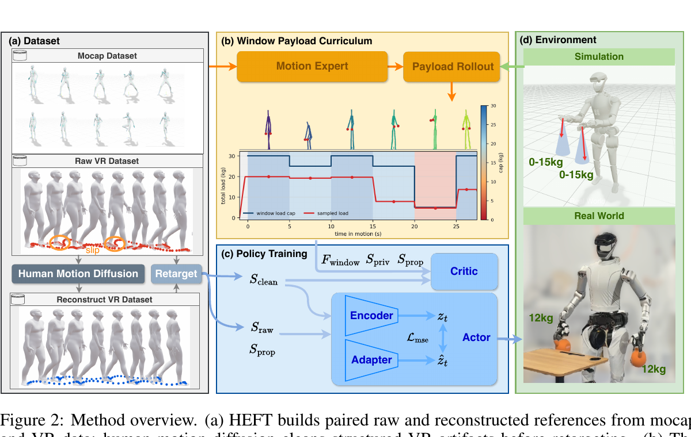

<!--
---
id: P0042
title_en: "HEFT: Heavy-Payload Full-size Humanoid Teleoperation with Privileged Motion Guidance and Windowed Payload Curriculum"
title_zh: "HEFT：基于特权动作引导与窗口化负载课程的重载全尺寸人形机器人遥操作"
year: 2026
date: 2026-07-02
venue: "arXiv preprint arXiv:2607.02332"
primary_category: tracking-wbc
tags:
  - motion-tracking
  - whole-body-control
  - teleoperation
  - force-control
  - curriculum-learning
  - distillation
  - vr
  - robot-state
  - keypoints
  - g1
  - mujoco
  - sim2real
  - real-time
authors:
  - Chenxin Liu
  - Qingzhou Lu
  - Guangxiao Yang
  - Xuanyang Shi
  - Chenghan Yang
  - Yanjiang Guo
  - Jianyu Chen
institutions:
  - Tsinghua University
  - RobotEra
  - Shanghai Qizhi Institute
paper_url: "https://arxiv.org/abs/2607.02332"
project_url: "https://heft.axell.top/"
github_url: "https://github.com/Axellwppr/motion_tracking"
video_url: null
open_source:
  code: full
  training_code: full
  inference_code: full
  model_weights: full
  dataset: partial
  robot_deployment: full
open_source_checked: 2026-09-04
robots:
  - Unitree G1
  - RobotEra L7
inputs:
  - raw VR reference
  - robot proprioception
  - privileged reconstructed motion during training
  - wrist payload state during training
outputs:
  - joint targets for whole-body teleoperation
read_status: deep-read
reproduce_status: not-started
local_materials:
  - "local_archive/P0042/heft.pdf"
created: 2026-09-04
updated: 2026-09-04
---
-->

# P0042｜HEFT：基于特权动作引导与窗口化负载课程的重载全尺寸人形机器人遥操作

*HEFT: Heavy-Payload Full-size Humanoid Teleoperation with Privileged Motion Guidance and Windowed Payload Curriculum*

[论文](https://arxiv.org/abs/2607.02332) · [项目页](https://heft.axell.top/) · [官方代码](https://github.com/Axellwppr/motion_tracking)

## 基本信息

<!-- AUTO-BASIC-INFO:START -->
> **作者**：Chenxin Liu、Qingzhou Lu、Guangxiao Yang、Xuanyang Shi、Chenghan Yang、Yanjiang Guo、Jianyu Chen
>
> **机构**：Tsinghua University、RobotEra、Shanghai Qizhi Institute
>
> **论文时间**：2026-07-02
>
> **期刊 / 会议**：arXiv preprint arXiv:2607.02332
>
> **主分类**：动作跟踪与全身控制
>
> **重点标签**：**动作跟踪** · **全身控制** · **遥操作** · **力控制** · **课程学习** · **蒸馏** · **虚拟现实** · **机器人状态** · **关键点** · **Unitree G1** · **MuJoCo** · **Sim2Real** · **实时**
>
> **阅读状态**：已精读　·　**复现状态**：未开始
<!-- AUTO-BASIC-INFO:END -->

### 资料与开源说明

- 论文于 2026-07-02 首次公开，当前出版信息为 arXiv 预印本。
- 官方仓库 `main` 分支提供训练、PMG、WPC 和数据构建代码，`sim2real` 分支提供部署运行时与 checkpoint。完整训练数据、WPC 窗口标签以及 VR 录制—重建流程仍标为待发布，数据按“部分公开”登记。

## 本文贡献

- 提出特权动作引导（PMG）：训练时用人体扩散模型清理后的 VR 参考监督 critic 与教师表征，actor 部署时仍只读取原始 VR 和本体状态，从而直接针对滑移、漂移与延迟学习鲁棒性。
- 提出窗口化负载课程（WPC）：让特权专家逐窗口搜索动作可承受的最大负载，训练时按时间窗采样载荷，而非给整段动作统一重量上限。
- 用 teacher–adapter–student 的 RMA 式训练把干净动作、负载和仿真特权信息蒸馏到可部署适配器，并在 Unitree G1 与全尺寸 RobotEra L7 上验证重载遥操作。

## 研究问题

VR 遥操作参考同时含脚滑、全局漂移、人体比例偏差、系统延迟与末端偏置；重物又会让不同动作片段呈现完全不同的负载极限。直接追踪原始 VR 会把伪影当目标，统一随机负载则会让某些窗口过易、另一些窗口必败。HEFT 要解决的是：如何只在训练期使用干净动作和负载特权信号，最终仍部署一个只依赖原始 VR 与本体观测的实时全身控制器。

## 原论文重点图

**图 1：HEFT 数据、WPC、策略训练与部署总览（原论文 Figure 2）。** 左侧把动作捕捉和原始 VR 分开处理：VR 先经人体动作扩散模型重建，再与原始序列共同重定向，形成 `S_raw/S_clean` 配对。上中部由动作专家做带载 rollout，逐时间窗得到负载上限。下中部训练时 critic 读取干净参考、窗口负载和特权状态；actor 的 encoder 读取特权输入产生教师潜变量，adapter 从原始参考和本体状态预测同一潜变量。部署到 L7 时只保留 actor 与 adapter，干净参考、专家和 critic 全部移除。

## 研究方法详细解读

### 总体流程：用训练期“干净答案”教会部署期适应

HEFT 的核心不是先把 VR 完美去噪后再部署，而是训练时同时保留原始与重建参考：原始参考代表机器人真实会收到的输入，重建参考只提供物理一致的指导。流程为：准备动作捕捉与成对 VR 数据；训练/使用动作专家；专家为每个五秒窗口搜索最大可承受负载；先用干净参考、负载与仿真状态训练教师策略；再蒸馏 adapter 仅凭原始参考和本体历史预测教师潜变量；最后微调学生。部署保留学生 actor 和 adapter，不运行人体扩散、专家或 critic。

### 整体训练主线：数据、专家、负载标签和学生策略

1. 汇总 SEED、100STYLE、LAFAN1 动捕数据，另采集 VR 序列；将所有人体运动重定向到目标机器人。
2. 对 VR 序列用 RoHM 人体动作扩散模型离线重建，形成时间对齐的原始/干净参考对。
3. 训练或加载无负载动作专家，对每个五秒窗口从 30 kg 向下搜索可稳定完成的最大负载，生成 WPC 标签。
4. 教师阶段用干净参考、机器人特权状态和实际负载编码潜变量，PPO 学习动作跟踪与负载补偿。
5. 蒸馏阶段让 adapter 从原始 VR 与可部署本体状态预测教师潜变量，以均方误差对齐。
6. 学生微调后导出 actor+adapter，以 50 Hz 处理在线 VR，低层 PD 以 200 Hz 执行。

### 数据构建与配对参考

动捕库包含 SEED 约 134.35 小时、100STYLE 约 18.78 小时和 LAFAN1 约 2.19 小时；另采 643 段 VR、约 6.08 小时，并保留未见动作测试。原始 VR `S_raw` 带有滑步、根漂移和身体偏置；RoHM 在人体空间做离线重建，保持操作者风格和时间节奏，同时产出更物理一致的 `S_clean`。两者再以同样机器人资产重定向，构成逐帧配对。PMG 并非把独立高斯噪声加到干净动作上，因为真实 VR 误差是时间相关、身体相关且非高斯的。

### 特权动作引导：teacher、adapter 与 student

教师 encoder 读取干净参考、模拟器特权状态和负载信息，得到 256 维潜变量 `z_t`；actor 结合它与本体信息输出动作。adapter 不看干净参考或载荷真值，只读原始 VR 与部署可得本体状态，预测 `z_hat_t`。蒸馏损失最小化两种潜变量的均方误差，使 adapter 学会从跟踪偏差、身体姿态和原始命令中推断隐含动力学扰动。最终 student 用 adapter 潜变量继续 PPO 微调，避免仅做离线特征回归却没有经历自身动作分布。

### 窗口化负载课程：动作片段决定可承受重量

同一段动作中，双脚站稳和单腿转身的负载能力不同。WPC 把序列切为五秒窗口，动作专家在该窗口内分别从 30 kg 开始、以 5 kg 递减试验，找到能稳定完成的最大负载上限。训练采样重量来自 `U(0, cap × progress / 0.8)`，课程前 80% 逐渐达到标注上限；左右手总负载再随机分配，并在腕部约 12° 圆锥内扰动力方向。它把难度绑定到时间窗口，避免用一条全局负载曲线掩盖动作差异。

### 观测、critic 特权与动作接口

actor 读取原始 VR 参考和机器人本体感知，避免部署依赖外部力传感器或干净人体状态；critic 则接收干净参考、窗口负载、机器人完整状态等特权量以改善值估计。训练网络把 encoder/adapter 潜变量注入 actor，动作最终映射为目标关节角并由 PD 执行。应特别区分三类量：`S_raw` 是在线命令，`S_clean` 是训练目标，`F_window` 与仿真状态是训练特权；把它们全部送进导出模型会得到无法真实部署的策略。

### 奖励、PPO 与蒸馏目标

PPO 回报同时跟踪根、关节和身体关键点，约束速度、接触、控制变化与关节安全；干净参考决定“应该像什么”，负载随机化决定“在什么动力学下完成”。教师优化 PPO，adapter 优化潜变量均方误差，学生微调阶段再以任务回报校正 adapter 预测误差造成的闭环偏移。论文把 PMG 与 WPC 分开消融：前者主要处理参考噪声与跨域，后者主要覆盖大负载临界区，二者不能互相替代。

### 并行训练配置与阶段关系

论文在 8×8192 环境、约 50 Hz 策略频率和 200 Hz 低层控制下累计约 `5×10^9` 帧训练。教师、adapter 蒸馏和学生微调有明确先后关系：专家和 RoHM 先离线产生标签/参考；教师训练时 adapter 不是控制入口；蒸馏时教师作为固定目标；最终学生用 adapter 闭环。复现若跳过专家负载搜索而对所有片段统一采 30 kg，会改变课程分布；若直接用干净参考部署，也会避开论文真正解决的 VR 噪声问题。

### 推理与真实遥操作流程

在线 VR 信号保持原始形式进入控制器，adapter 结合机器人本体观测估计潜在扰动，student actor 输出关节目标。策略以 50 Hz 更新，PD 以 200 Hz 执行；RoHM 重建、窗口标签搜索和 critic 都不在线运行，因此推理成本不会随人体扩散模型增加。作者在 G1 与全尺寸 L7 上部署，其中 L7 展示双手各 12 kg、总 24 kg 的搬运。该结果依赖机器人额定力矩、腕部连接、PD 与载荷安装，不能把同一 checkpoint 直接迁移到质量分布不同的机器人。

### 部署边界与复现契约

完整复现必须对齐原始/干净 VR 的时间同步、SMPL-X/机器人重定向、五秒窗口划分、成功判定、5 kg 搜索步长、负载作用点与方向、teacher/student 权重、256 维潜变量、观测归一化、关节顺序和控制频率。官方仓库只给部分 smoke 数据，明确说明并非论文精确训练集；checkpoint 在 `sim2real` 分支而训练代码在 `main`。本页未运行分支、模型或实机，论文的重载结果不能作为其他 L7/G1 资产的安全证明。

## 实验结果与结论

### 实验设置

- 数据：大规模动捕库、成对原始/重建 VR 数据与未见动作；比较 PMG、WPC、无适配器和若干现有 tracker。
- 指标：全局位置误差（PMG XY）、MPJPE、负载成功率、动作跟踪与实机可承受重量。
- 平台：Unitree G1、RobotEra L7；仿真与真实重载遥操作。

### 主要结果

- PMG 的平面根误差约为 G1 0.544、L7 0.560；G1 的 MPJPE 约 0.021 m，优于论文对照 SONIC 的 0.043 m 与 TWIST2 的 0.061 m。
- WPC 在 25 kg 总负载下成功率约 90%，30 kg 下约 75%；真实 L7 展示总计 24 kg 的遥操作搬运。
- 数值支持成对真实噪声与窗口难度建模，但真实实验规模、负载安装方式和长期热安全不足以证明任意重载任务都可直接部署。

## 局限与复现提醒

- **负载建模：** 训练外力主要施加在腕部，真实物体的惯量、碰撞和双手闭链未被完全建模。
- **数据迁移：** 换机器人需要重新重定向、训练专家并生成 WPC 窗口标签，不能只替换 URDF。
- **开源边界：** 完整论文数据和 VR 采集/重建流程尚未发布；公开 smoke 数据不能复现论文数字。
- **验证边界：** 本页只做论文与仓库静态核验，未运行训练、sim2sim 或重载实机。

## 阅读与复现状态

- 阅读：已精读论文方法、附录与实验。
- 代码：已核验 `main`/`sim2real` 分工，尚未安装或运行。
- 仿真、训练和实机：均未验证，复现状态为“未开始”。

## 参考资料

- [arXiv 论文页](https://arxiv.org/abs/2607.02332)
- [官方项目页](https://heft.axell.top/)
- [官方代码](https://github.com/Axellwppr/motion_tracking)

## 更新记录

- 2026-09-04：创建 P0042 精读档案；核验作者机构、首次公开日期及分支开源范围；收录原论文 Figure 2，详细解读原始/干净 VR 配对、PMG、WPC、教师蒸馏和重载部署边界。
