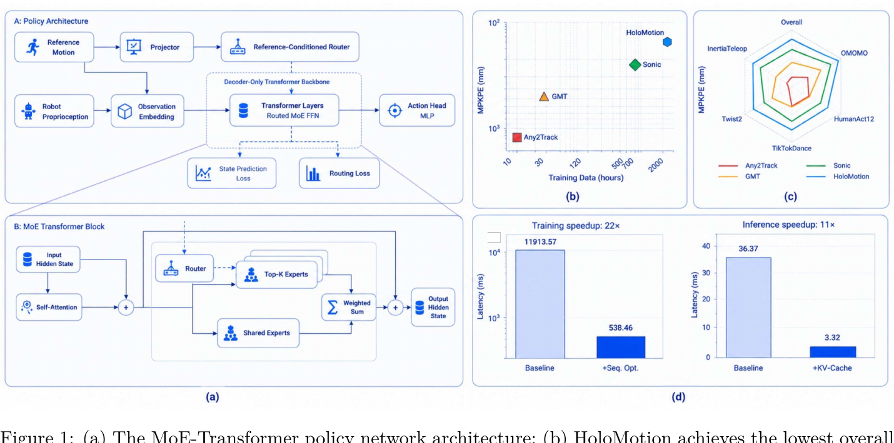

<!--
---
id: P0043
title_en: "HoloMotion-1 Technical Report"
title_zh: "HoloMotion-1 技术报告：面向零样本全身动作跟踪的人形机器人动作基础模型"
year: 2026
date: 2026-05-14
venue: "arXiv preprint arXiv:2605.15336"
primary_category: tracking-wbc
tags:
  - motion-tracking
  - whole-body-control
  - transformer
  - mixture-of-experts
  - reinforcement-learning
  - large-scale-data
  - video
  - motion-capture
  - g1
  - isaac-lab
  - mujoco
  - ros2
  - sim2real
  - real-time
  - zero-shot
  - generalization
authors:
  - Maiyue Chen
  - Kaihui Wang
  - Bo Zhang
  - Xihan Ma
  - Zhiyuan Yang
  - Yi Ren
  - Qijun Huang
  - Zihao Zhu
  - Yucheng Wang
  - Zhizhong Su
institutions:
  - Horizon Robotics
paper_url: "https://arxiv.org/abs/2605.15336"
project_url: "https://horizonrobotics.github.io/robot_lab/holomotion/"
github_url: "https://github.com/HorizonRobotics/HoloMotion"
video_url: null
open_source:
  code: full
  training_code: full
  inference_code: full
  model_weights: full
  dataset: partial
  robot_deployment: full
open_source_checked: 2026-09-04
robots:
  - Unitree G1 29-DoF
inputs:
  - robot proprioception history
  - current and ten-frame future motion reference
outputs:
  - target joint positions
  - auxiliary robot state and contact predictions during training
read_status: deep-read
reproduce_status: not-started
local_materials:
  - "local_archive/P0043/holomotion.pdf"
created: 2026-09-04
updated: 2026-09-04
---
-->

# P0043｜HoloMotion-1 技术报告：面向零样本全身动作跟踪的人形机器人动作基础模型

*HoloMotion-1 Technical Report*

[论文](https://arxiv.org/abs/2605.15336) · [项目页](https://horizonrobotics.github.io/robot_lab/holomotion/) · [官方代码](https://github.com/HorizonRobotics/HoloMotion)

## 基本信息

<!-- AUTO-BASIC-INFO:START -->
> **作者**：Maiyue Chen、Kaihui Wang、Bo Zhang、Xihan Ma、Zhiyuan Yang、Yi Ren、Qijun Huang、Zihao Zhu、Yucheng Wang、Zhizhong Su
>
> **机构**：Horizon Robotics
>
> **论文时间**：2026-05-14
>
> **期刊 / 会议**：arXiv preprint arXiv:2605.15336
>
> **主分类**：动作跟踪与全身控制
>
> **重点标签**：**动作跟踪** · **全身控制** · **Transformer** · **混合专家** · **强化学习** · **大规模数据** · **视频** · **动作捕捉** · **Unitree G1** · **Isaac Lab** · **MuJoCo** · **ROS 2** · **Sim2Real** · **实时** · **零样本** · **泛化**
>
> **阅读状态**：已精读　·　**复现状态**：未开始
<!-- AUTO-BASIC-INFO:END -->

### 资料与开源说明

- arXiv 首次公开日期为 2026-05-14；本页阅读的是 2026-05-19 的 v2 技术报告，并按首次公开日期登记。
- 当前官方仓库已从报告时的 HoloMotion-1 继续迭代到 v1.4.x，提供训练、HoloSMPL/HoloRetarget、评估、模型和 Docker/ROS 2 部署资料。报告数字对应论文快照，不能直接归因于后续版本。
- 论文使用 2000 小时以上混合动作，公开仓库提供数据处理工具和部分来源入口，但完整训练语料并未作为一个可直接下载的数据包发布，因此数据标为“部分公开”。

## 本文贡献

- 将视频重建、动作捕捉和自有采集合并为 2000 小时以上混合动作语料，使人形动作跟踪首次系统扩展到野外视频覆盖的长尾动作。
- 设计仅由参考动作控制路由的稀疏 MoE decoder-only Transformer，在约 4 亿总参数下每步只激活约 700 万参数，避免仿真状态变化导致专家路由不稳定。
- 用连续序列 PPO、KV 环形缓存、状态预测和路由正则同时解决大模型训练吞吐与实时推理，在真实 G1 上实现无需任务微调的动作迁移。

## 研究问题

MoCap 数据干净但规模小，视频重建动作多样却带噪；普通 MLP 随数据扩大后容量饱和，而密集 Transformer 又难以在 50 Hz 控制中实时运行。HoloMotion-1 研究如何让大规模异构动作真正进入闭环强化学习，并让专家路由只依赖动作意图、不会被瞬时仿真状态扰乱，同时把 4 亿参数模型压到实时激活开销。

## 原论文重点图

**图 1：HoloMotion-1 网络、MoE 模块与效率结果（原论文 Figure 1）。** 左上是策略主链：参考动作经投影器产生路由条件，机器人本体感知经观测嵌入进入 decoder-only Transformer，动作头输出控制命令；训练期另有状态预测与路由损失。左下展示每个块的自注意力、共享专家和 Top-K 路由专家。右侧说明在约 2000 小时数据上取得更低 MPKPE，连续序列训练约加速 22 倍，KV cache 将单步延迟从约 36.37 ms 降到 3.32 ms。

## 研究方法详细解读

### 总体流程：先扩数据，再让大模型在 PPO 闭环中可训练、可缓存

HoloMotion-1 的核心不是把 MoE Transformer 当作离线动作生成器，而是直接把它训练成反馈控制策略。完整链路为：统一多来源人体动作；用 GMR/HoloRetarget 映射到 29 自由度 G1；构建当前本体历史和十帧未来参考；用连续序列级 PPO 在多 GPU 仿真中训练路由 MoE；用辅助状态预测和路由约束稳定专家分工；导出策略后以 KV 环形缓存逐帧推理。训练期 critic、奖励和大规模仿真不部署，真实机器人保留 actor、参考缓存、KV cache、动作头和 PD 接口。

### 整体训练主线：异构语料到真实 G1

1. 收集 MotionMillion 野外视频重建动作、AMASS/LAFAN 动捕和 Pico/Noitom 自采动作，统一到 AMASS 风格人体表示。
2. 通过 GMR/HoloRetarget 将人体动作映射到 G1，形成带关节、根、身体关键点和接触信息的机器人参考。
3. actor 读取 32 帧本体上下文与当前/未来十帧参考，MoE Transformer 输出 29 维目标；critic 使用特权状态计算 PPO 优势。
4. 以连续轨迹段而非大量重叠窗口训练，联合优化 PPO、状态/接触预测和路由负载约束。
5. 完成跨数据源宏平均评测，导出模型并在 MuJoCo/ROS 2 中复核观测契约。
6. 部署到 G1 后以 KV cache 滚动更新，不重新编码全部 32 帧历史。

### 混合动作语料与覆盖逻辑

语料中 MotionMillion 视频重建数据超过 2000 小时，是动作多样性的主体；AMASS 超过 40 小时、LAFAN 约 4.6 小时提供高质量动捕；Pico 与 Noitom 各类自采总计十小时以上，补充遥操作和部署分布。视频数据并非质量最高，却覆盖舞蹈、日常、交互与长尾姿态；动捕和自采数据用来锚定精度。训练与评估按来源区分，避免数量巨大的视频动作淹没高保真集。论文称“2000+ 小时”是原始混合规模，不等于每段都同质量或可无筛选地实机执行。

### 观测、参考窗口与动作输出

目标机器人为 29 自由度 G1。策略同时接收机器人本体感知历史和动作参考：参考包含当前与未来十帧，用于表达即将到来的动态；本体上下文长度 32，用于推断速度、接触与过去动作后果。actor 输出关节位置目标，低层 PD 负责力矩。critic 在训练期读取更完整仿真状态。参考和本体在进入主干前分别投影，后者提供闭环状态，前者既提供动作条件又决定专家路由，两条信息流角色不同。

### Decoder-only MoE Transformer 主干

主干宽度 512，使用 RMSNorm、RoPE、分组查询注意力和 QK normalization；每个时间 token 经过因果自注意力，只访问过去。本体/参考嵌入进入 Transformer 后，稀疏 FFN 包含 1024 个路由专家与 1 个共享专家，每次选择 Top-2；总参数约 4 亿，但连同注意力和选中专家每步激活约 700 万。共享专家学习通用平衡与控制模式，路由专家承载动作族差异，动作头把最终隐状态映射为关节目标。

### 参考条件路由为何不读取机器人状态

普通 MoE router 若同时读取仿真状态，同一参考动作会因为瞬时扰动被派给不同专家；早期不稳定 rollout 又会让路由分布快速漂移，强化学习信号更噪。HoloMotion 先用参考投影器得到路由条件，专家选择只由期望动作决定；真实状态仍进入自注意力和专家计算，因此控制输出能反馈纠错，但不会改变“由哪个专家负责该动作”。这个设计把技能分工与瞬时物理误差解耦，是论文区别于通用语言 MoE 的关键。

### PPO、奖励与辅助预测

主目标是动作跟踪 PPO，奖励约束根与身体关键点、关节姿态/速度、接触和控制正则，并配合域随机化与失败终止。为了让大模型隐状态不仅记住命令，训练还预测基座速度、接触以及机器人/参考的根相对身体位置；这些辅助头给表征提供稠密动力学监督。路由损失约束专家负载，并加入“死亡专家”间隔，避免少数专家垄断 token。辅助头和 critic 只服务训练，导出动作策略时不必保留全部支路。

### 连续序列级 PPO 与吞吐加速

传统做法把每个控制时刻都展开成含 32 帧历史的滑窗，临近样本重复计算绝大多数 token。HoloMotion 将 rollout 保持为连续段，一次前向并行处理整段，因果掩码保证每个位置只访问过去，所有位置同时参与 PPO 与辅助损失。这样既避免重叠窗口复制，也与部署的逐 token 缓存一致。论文报告相对基线训练延迟从约 11913.57 ms 降至 538.46 ms，约 22 倍，但该数字依赖其序列长度、实现和硬件，不能视为任意 Transformer 的固定加速倍数。

### KV 环形缓存与在线推理

部署首帧编码上下文，之后每个 50 Hz 控制周期只为最新 token 计算 query/key/value，并把 key/value 写入固定长度环形缓存，淘汰最旧位置。注意力成本由每步重算整个窗口降为增量更新，缓存占用保持 O(C) 而非随运行时长增长。报告将延迟从约 36.37 ms 降到 3.32 ms，达到 200–300 Hz 级模型吞吐；实际机器人仍按 50 Hz 控制。替换上下文长度、RoPE 位置或导出后缓存布局都会破坏 checkpoint 契约。

### 训练规模、推理部署与复现边界

论文报告 64 张 RTX 5090 训练约六天，约 9200 GPU 小时；训练完成后经 Isaac 评估、模型导出、MuJoCo sim2sim 和 ROS 2 真实部署。报告的路线图包含“模仿任意姿态、跟随任意命令、适应任意地形、迁移任意本体”，HoloMotion-1 实际完成的是第一阶段动作跟踪，不能把后续愿景当论文已验证能力。复现需锁定论文 v1 模型还是当前 v1.4.x、29-DoF 资产、HDF5 数据格式、十帧参考、32 帧历史、专家数/Top-K、序列 PPO、归一化、PD 与 KV cache 导出接口。本页未运行代码或模型。

## 实验结果与结论

### 实验设置

- 数据集：InertiaTeleop、OMOMO、HumanAct12、TikTokDance 等多来源未见集合，使用来源宏平均防止大集合主导。
- 基线：Any2Track、GMT、SONIC 等通用动作 tracker；同时消融数据规模、模型结构、序列训练和缓存。
- 指标：MPKPE、成功率、训练/推理延迟，以及跨来源综合表现。

### 主要结果

- HoloMotion-1 的总体 MPKPE 约 124.57 mm，报告对照 SONIC 约 227.95 mm；总体成功率约 97.55%，并在多个来源上保持较均衡误差。
- 连续序列优化报告约 22 倍训练加速，KV cache 在对应设置下最高约 11 倍推理加速，使大总参数策略仍能实时控制。
- 结果证明混合数据和稀疏激活在论文 G1 协议中的缩放价值，但没有证明后续“任意地形/任意本体”路线图目标已经实现。

## 局限与复现提醒

- **数据质量：** 视频重建提供规模，也带来脚滑、接触和身体比例噪声；不同来源比例是模型能力的一部分。
- **版本漂移：** 当前仓库已迭代到 v1.4.x，报告的 4 亿参数、数据和结果必须与论文 checkpoint 对齐。
- **算力要求：** 稀疏激活降低单步计算，不消除 1024 专家参数存储和大规模 PPO 的训练成本。
- **证据边界：** 本页只完成论文/仓库精读与原图提取，未做训练、sim2sim、ROS 2 或真机验证。

## 阅读与复现状态

- 阅读：已精读技术报告及当前官方仓库说明。
- 资源：已核验训练、模型、数据工具和部署文档的当前公开范围。
- 运行：未运行代码、权重或机器人，复现状态为“未开始”。

## 参考资料

- [arXiv 论文页](https://arxiv.org/abs/2605.15336)
- [官方项目页](https://horizonrobotics.github.io/robot_lab/holomotion/)
- [官方代码](https://github.com/HorizonRobotics/HoloMotion)

## 更新记录

- 2026-09-04：创建 P0043 精读档案；核验作者机构、版本与开源边界；收录原论文 Figure 1，详细解读混合数据、参考路由 MoE、连续序列 PPO、KV cache 与部署契约。
