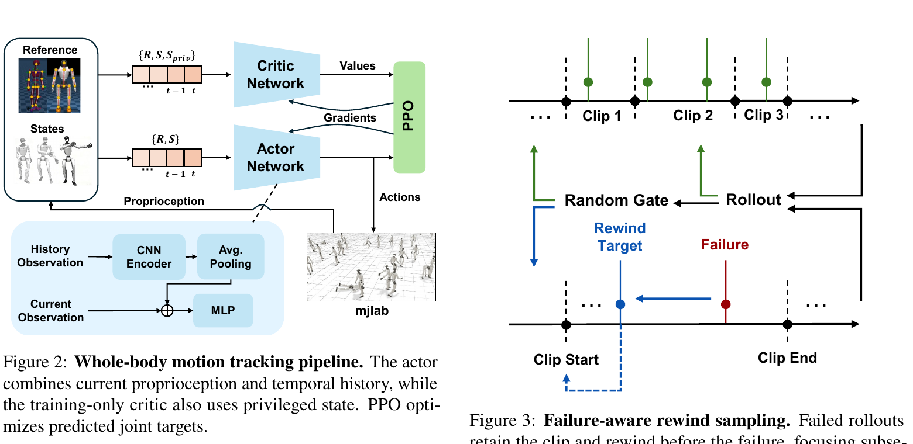

<!--
---
id: P0044
title_en: "Teleopit: A Full-Embodiment Humanoid Teleoperation System"
title_zh: "Teleopit：全具身人形机器人遥操作系统"
year: 2026
date: 2026-08-03
venue: "arXiv preprint arXiv:2608.01834"
primary_category: engineering
tags:
  - teleoperation
  - whole-body-control
  - motion-tracking
  - dexterous-hand
  - inverse-kinematics
  - optimization
  - imitation-learning
  - vr
  - keypoints
  - g1
  - mujoco
  - onnx
  - sim2sim
  - sim2real
  - real-time
authors:
  - Bingqian Wu
  - Zicheng Xu
  - Xianghui Fan
  - Dayu Li
  - Xiangru Huang
institutions:
  - Westlake University
  - Shanghai Innovation Institute
paper_url: "https://arxiv.org/abs/2608.01834"
project_url: "https://botrunner64.github.io/teleopit-page/"
github_url: "https://github.com/BotRunner64/Teleopit"
video_url: null
open_source:
  code: full
  training_code: full
  inference_code: full
  model_weights: full
  dataset: partial
  robot_deployment: full
open_source_checked: 2026-09-04
robots:
  - Unitree G1
inputs:
  - Pico body tracking
  - hand keypoints
  - head pose
  - robot proprioception
  - RGB images for learned task policies
outputs:
  - whole-body joint targets
  - dexterous hand commands
  - two-DoF viewpoint command
  - recorded demonstrations
read_status: deep-read
reproduce_status: not-started
local_materials:
  - "local_archive/P0044/teleopit.pdf"
created: 2026-09-04
updated: 2026-09-04
---
-->

# P0044｜Teleopit：全具身人形机器人遥操作系统

*Teleopit: A Full-Embodiment Humanoid Teleoperation System*

[论文](https://arxiv.org/abs/2608.01834) · [项目页](https://botrunner64.github.io/teleopit-page/) · [官方代码](https://github.com/BotRunner64/Teleopit) · [中文文档](https://botrunner64.github.io/Teleopit/zh-Hans/)

## 基本信息

<!-- AUTO-BASIC-INFO:START -->
> **作者**：Bingqian Wu、Zicheng Xu、Xianghui Fan、Dayu Li、Xiangru Huang
>
> **机构**：Westlake University、Shanghai Innovation Institute
>
> **论文时间**：2026-08-03
>
> **期刊 / 会议**：arXiv preprint arXiv:2608.01834
>
> **主分类**：工程与实机部署
>
> **重点标签**：**遥操作** · **全身控制** · **动作跟踪** · **灵巧手** · **逆运动学** · **优化** · **模仿学习** · **虚拟现实** · **关键点** · **Unitree G1** · **MuJoCo** · **ONNX** · **Sim2Sim** · **Sim2Real** · **实时**
>
> **阅读状态**：已精读　·　**复现状态**：未开始
<!-- AUTO-BASIC-INFO:END -->

### 资料与开源说明

- 论文于 2026-08-03 首次公开，当前出版信息为 arXiv 预印本。
- 官方仓库采用 Apache-2.0，当前提供全身跟踪训练、ONNX sim2sim、Pico 4 遥操作、G1 部署、模型以及手动 HDF5/NPZ 记录流程。论文使用的 96 条任务示范不是作为完整可复现实验数据集统一发布，数据登记为“部分公开”。

## 本文贡献

- 把身体、灵巧手和主动视角作为三个并行控制通道统一到同一遥操作运行时，使操作者不只“控制身体”，还能同步控制摄像头视角和不同机械手。
- 为全身 tracker 引入十帧历史卷积编码与失败感知回退采样，让训练集中稀少但关键的跌倒前转换被反复学习。
- 提出只需语义 link 映射的通用手部优化目标，并把遥操作轨迹直接转换成可供 ACT/GR00T 等模仿学习策略使用的 43 维状态与 52 维动作。

## 研究问题

现有人形遥操作往往分别处理身体、双手和头部，导致时间不同步、接口不一致，也难把采集数据直接用于学习策略。身体 tracker 在 VR 参考突然变化时容易跌倒；手部重定向则常为每种硬件重新调目标。Teleopit 研究如何把三类通道组合成一个低延迟系统，并让训练、实时控制、视觉反馈、记录和后续模仿学习共享明确的数据契约。

## 原论文重点图

**图 1：全身跟踪器与失败感知回退采样（原论文 Figures 2–3）。** 左图中 actor 读取当前本体状态、动作参考和十帧历史的 CNN/平均池化表示，critic 额外读取训练期特权量，PPO 输出 29 维关节目标。右图表示 rollout 一旦在 clip 中失败，不立即均匀换到别处，而是以高概率保留该 clip，将起点回退到失败之前，使后续更新反复覆盖困难转换。两张图共同说明系统级遥操作依赖的身体控制底座如何训练。

## 研究方法详细解读

### 总体流程：三条控制通道汇合成一个具身数据闭环

Teleopit 的核心不是一个单独的运动跟踪网络，而是“身体 RL + 手部优化 + 视角控制 + 记录/回放”的完整系统。Pico 提供 24 个身体关节、每手 26 个关键点和头部位姿；身体参考进入 PPO tracker，手部关键点进入通用优化器，头部位姿转成两自由度相机命令。运行时异步接收传感器并同步下发三个通道，同时记录状态、动作和 RGB；记录数据可再训练 ACT 或 GR00T。训练期 critic 和失败回退采样不部署，手部优化器与运行时则在线保留。

### 整体训练主线：跟踪器、重定向器与任务策略分阶段建立

1. 将动作数据映射为 G1 身体参考，在 mjlab 中生成当前状态、十帧历史与训练特权观测。
2. 用 PPO 训练 29 自由度身体 tracker；失败 rollout 触发回退采样，提高困难转移覆盖。
3. 为目标灵巧手建立语义 link 映射和机械耦合约束，使用同一优化目标做关键点重定向，不训练手部神经网络。
4. 将 Pico 身体、手和头数据接入异步运行时，身体 50 Hz 推理、PD 200 Hz，并同步相机与手部命令。
5. 记录机器人状态、执行动作和 RGB，转换为任务学习所需的状态—动作格式。
6. 分别训练 ACT 与 GR00T N1.7，再让高层任务策略输出命令、由身体 tracker 承接根与身体动作。

### Pico 输入与三类输出表示

输入由 24 关节身体骨架、左右手各 26 个关键点和头部六自由度位姿组成。系统把身体转为机器人参考姿态，手部转为目标手关节命令，头部则映射为俯仰/偏航两维视角。三者不强行进入一个网络：身体需要动力学稳定，手部需要几何适配，头部需要快速直观的相机控制。运行时负责时间戳、缓冲和下发，使不同计算路径仍在一个操作者动作上对齐。

### 全身 tracker 的观测、网络与动作

actor 接收当前机器人本体状态、当前动作参考和最近十个控制步的历史。历史先经一维时间卷积提取接触/动量变化，再做全局平均池化，与当前帧拼接进入 MLP；它不依赖额外速度估计器。critic 在训练期额外看到完整参考、仿真状态与特权量。actor 输出 29 维归一化动作，经逐关节尺度和默认姿态得到目标关节角；策略 50 Hz 更新，PD 以 200 Hz 跟踪，并以 14 个身体 link 计算密集全身奖励。

### 失败感知回退采样

均匀 clip 采样会反复训练容易的稳态步态，却很少命中翻转、落地或参考突变前的几帧。Teleopit 在 rollout 失败时以约 0.8 概率保留当前 clip，并把参考时间回退到失败之前的随机位置；下一次 rollout 直接重练这段转换。若成功或随机门未触发，再按常规采新 clip。它用失败信号定位难点，不需要单独训练难度模型；同时也要保留随机重置，否则训练会被少数不可行片段垄断。

### PPO 奖励与训练期特权信息

奖励由关节、根、身体 link 位姿/速度跟踪与动作平滑、关节限制、接触安全等项组成。actor 的信息严格可部署，critic 使用更完整的机器人和参考状态以降低优势估计方差。PPO 梯度同时更新历史编码器和 MLP actor；回退采样只改变起点分布，不直接修改奖励。复现时需要把失败判定、回退概率、最大回退范围、十帧窗口和参考坐标系一并对齐，否则即使网络形状相同，困难片段分布也会完全不同。

### 通用灵巧手重定向优化

每只手根据人手与机器人手的语义 link 对应求解 SLSQP。目标包含归一化骨段方向误差，使不同手掌尺寸下保留手势；对指尖距离采用单侧约束，只在目标距离小于约 4 cm 时强制靠近，避免不可达张开姿态扭曲；拇指在局部手掌坐标中单独定义方向，并加入时间平滑。机械耦合通过约束表达。更换手型主要修改 link 映射和耦合，不为每种手重调一套损失超参数，但这并不保证所有手都具有相同可达域。

### 异步运行时、延迟与主动视角

传感器接收、身体推理、手部优化、相机控制、机器人 I/O、视频和数据记录分线程/进程运行，避免最慢模块阻塞全部通道。论文测得身体控制约 0.1 s、视角约 0.05 s、视频约 0.1 s、手部约 0.15 s 的端到端延迟。头部命令直接控制两自由度视角，让操作者主动观察遮挡区域；视觉反馈的延迟与控制延迟分开测量。部署版本必须匹配 host-policy 协议，官方文档明确不兼容旧 envelope 和旧归一化 OpenNeck API。

### 示范记录与 ACT/GR00T 动作契约

任务策略的低维状态为 43 维：29 维身体、12 维双手和 2 维视角；原始记录动作为 50 维，包括根平移 3、根四元数 4 和 43 维关节/视角。学习时动作改为 52 维：平面根位移使用相对量，高度为绝对量，根旋转采用相对 6D 表示，再加 43 维控制。身体 tracker 只承接根与身体参考，手和颈部命令绕过 tracker 直接执行。论文用 96 条示范训练 ACT 和 GR00T N1.7，RGB 30 Hz，预测 action chunk 并每次执行 20 步。

### 推理部署与复现边界

真实链路需要 Pico 标定、机器人/手/颈模型、29 关节顺序、ONNX 输入、历史缓冲、PD、手部 SLSQP、异步协议和急停共同匹配。官方仓库提供多 XML 选择和外部资产管理；模型与运行时必须同版本。论文中的任务成功还依赖操作者、相机位置、手爪、示范分布与高层策略，不能只归功于身体 tracker。本页未执行 Pico、ONNX、MuJoCo、训练或 G1 部署，也未核验硬件安全。

## 实验结果与结论

### 实验设置

- 系统评测：身体、双手、主动视角延迟；不同灵巧手重定向；真实 G1 遥操作任务。
- 学习评测：96 条遥操作示范，30 Hz RGB，ACT 与 GR00T N1.7 使用动作块执行。
- 指标：控制/视频延迟、任务完成率与跨手型适配。

### 主要结果

- 论文报告身体约 0.1 s、主动视角约 0.05 s、视频约 0.1 s、手部约 0.15 s 延迟，三通道能同时用于真实任务。
- 在论文任务协议下，ACT 成功率约 90%，GR00T N1.7 约 95%，说明遥操作记录可以直接支持下游学习。
- 这些数字基于给定 96 条示范和任务集合，不代表任意新任务或新灵巧手都能零配置达到相同成功率。

## 局限与复现提醒

- **系统耦合：** 三条通道算法独立，但版本、时间戳和协议必须一致；局部模块启动成功不代表整体低延迟。
- **手部边界：** 语义映射减少调参，仍受目标手自由度、机械耦合和可达域限制。
- **数据边界：** 公开记录工具与样例不等于论文完整 96 条任务示范数据。
- **验证边界：** 本页只做论文/文档/仓库静态精读，未运行训练、推理、sim2sim 或实机。

## 阅读与复现状态

- 阅读：已精读论文方法、系统、延迟与学习实验。
- 代码：已核验 Apache-2.0、训练/部署/模型与中文文档，未运行。
- 复现：未准备环境，状态保持“未开始”。

## 参考资料

- [arXiv 论文页](https://arxiv.org/abs/2608.01834)
- [官方项目页](https://botrunner64.github.io/teleopit-page/)
- [官方代码](https://github.com/BotRunner64/Teleopit)
- [官方中文文档](https://botrunner64.github.io/Teleopit/zh-Hans/)

## 更新记录

- 2026-09-04：创建 P0044 精读档案；核验作者机构、许可与发布资源；收录原论文 Figures 2–3，详细解读身体 RL、失败回退、通用手部优化、主动视角、异步运行时及示范动作契约。
