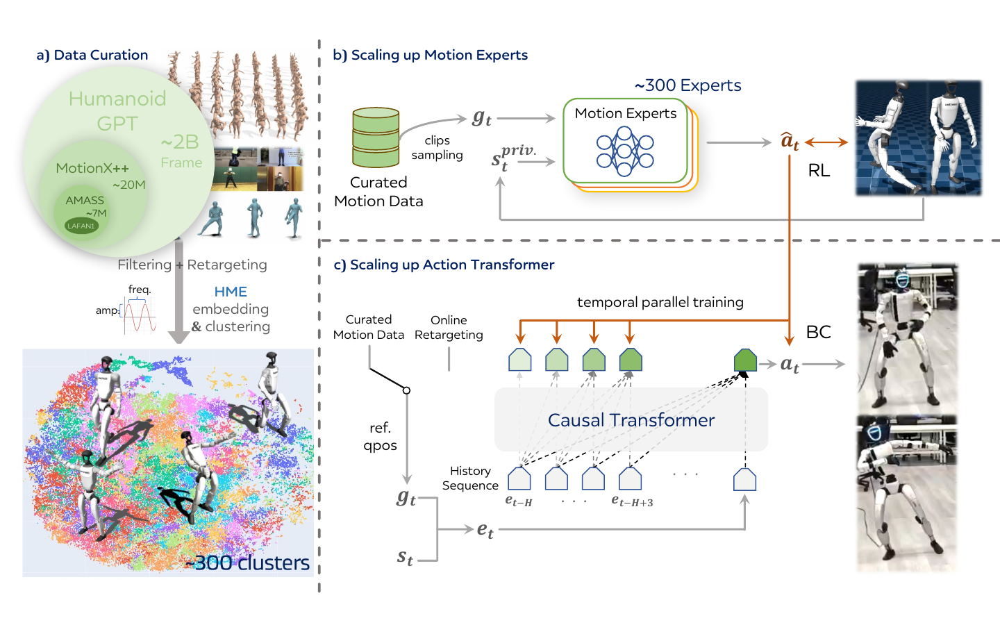

<!--
---
id: P0045
title_en: "Humanoid-GPT: Scaling Data and Structure for Zero-Shot Motion Tracking"
title_zh: "Humanoid-GPT：通过数据与结构扩展实现零样本动作跟踪"
year: 2026
date: 2026-06-02
venue: "IEEE/CVF Conference on Computer Vision and Pattern Recognition (CVPR) 2026"
primary_category: tracking-wbc
tags:
  - motion-tracking
  - whole-body-control
  - transformer
  - autoregressive
  - reinforcement-learning
  - imitation-learning
  - distillation
  - large-scale-data
  - motion-capture
  - g1
  - mujoco
  - onnx
  - tensorrt
  - sim2real
  - real-time
  - zero-shot
  - generalization
authors:
  - Zekun Qi
  - Xuchuan Chen
  - Dairu Liu
  - Chenghuai Lin
  - Yunrui Lian
  - Sikai Liang
  - Zhikai Zhang
  - Yu Guan
  - Jilong Wang
  - Wenyao Zhang
  - Xinqiang Yu
  - He Wang
  - Li Yi
institutions:
  - Tsinghua University
  - Galbot Inc.
  - Beihang University
  - Shanghai Jiao Tong University
  - Peking University
  - Shanghai Qizhi Institute
paper_url: "https://arxiv.org/abs/2606.03985"
project_url: "https://qizekun.github.io/Humanoid-GPT/"
github_url: "https://github.com/GalaxyGeneralRobotics/Humanoid-GPT"
video_url: null
open_source:
  code: partial
  training_code: "no"
  inference_code: full
  model_weights: full
  dataset: "no"
  robot_deployment: full
open_source_checked: 2026-09-04
robots:
  - Unitree G1 29-DoF
inputs:
  - robot proprioception
  - online-retargeted or prerecorded reference motion
  - causal state-action history
outputs:
  - target joint actions
read_status: deep-read
reproduce_status: not-started
local_materials:
  - "local_archive/P0045/humanoid-gpt.pdf"
created: 2026-09-04
updated: 2026-09-04
---
-->

# P0045｜Humanoid-GPT：通过数据与结构扩展实现零样本动作跟踪

*Humanoid-GPT: Scaling Data and Structure for Zero-Shot Motion Tracking*

[论文](https://arxiv.org/abs/2606.03985) · [项目页](https://qizekun.github.io/Humanoid-GPT/) · [官方代码](https://github.com/GalaxyGeneralRobotics/Humanoid-GPT)

## 基本信息

<!-- AUTO-BASIC-INFO:START -->
> **作者**：Zekun Qi、Xuchuan Chen、Dairu Liu、Chenghuai Lin、Yunrui Lian、Sikai Liang、Zhikai Zhang、Yu Guan、Jilong Wang、Wenyao Zhang、Xinqiang Yu、He Wang、Li Yi
>
> **机构**：Tsinghua University、Galbot Inc.、Beihang University、Shanghai Jiao Tong University、Peking University、Shanghai Qizhi Institute
>
> **论文时间**：2026-06-02
>
> **期刊 / 会议**：IEEE/CVF Conference on Computer Vision and Pattern Recognition (CVPR) 2026
>
> **主分类**：动作跟踪与全身控制
>
> **重点标签**：**动作跟踪** · **全身控制** · **Transformer** · **自回归** · **强化学习** · **模仿学习** · **蒸馏** · **大规模数据** · **动作捕捉** · **Unitree G1** · **MuJoCo** · **ONNX** · **TensorRT** · **Sim2Real** · **实时** · **零样本** · **泛化**
>
> **阅读状态**：已精读　·　**复现状态**：未开始
<!-- AUTO-BASIC-INFO:END -->

### 资料与开源说明

- 论文 2026-06-02 首次公开，官方项目和仓库标注 CVPR 2026 接收。
- 官方仓库描述中出现 “AstraBrain-WBC 0.5”，这是所发布实现/模型的产品命名；论文实体仍是 Humanoid-GPT，不能拆成两篇或改写论文题名。
- 截至 2026-09-04，仓库已发布推理/部署代码和预训练 checkpoint；TODO 仍列出训练代码与训练数据，故代码整体为“部分公开”，训练代码和数据记为“未公开”。

## 本文贡献

- 构建约 20 亿帧机器人动作语料，把多套动捕、视频重建和自有数据统一到 29 自由度 G1，并用频率—幅度动作嵌入把语料分成约 300 余个运动簇。
- 先为每个运动簇训练 PPO 专家，再用 DAgger 将数百专家蒸馏进一个因果 Transformer，把大规模序列建模用于实时闭环动作跟踪。
- 系统比较 2M、20M、200M、2B 帧数据和不同模型规模/结构，展示 Transformer 在数据扩大时继续受益，而同量级 MLP/TCN 更早饱和。

## 研究问题

一个 RL tracker 直接在 20 亿帧上训练会同时遇到动作分布极不均衡、稀有技能回报被淹没和大 Transformer 的 on-policy 采样成本。只扩大 MLP 又不一定获得长时上下文能力。Humanoid-GPT 研究如何先用大量小专家把连续动作空间分区学习，再通过闭环数据聚合蒸馏为一个可实时部署的因果策略，并量化数据规模、模型规模与动作多样性的相互作用。

## 原论文重点图

**图 1：Humanoid-GPT 数据、专家和因果 Transformer 三阶段总览（原论文 Figure 2）。** 左侧把 AMASS、Motion-X++ 等来源过滤、重定向并用 HME 频率/幅度表征聚类；右上针对每个簇训练 PPO motion expert；右下用在线 rollout 的 DAgger 监督因果 Transformer，历史 token 只访问过去，而同一序列多个位置可并行计算行为克隆损失。最终单一 Transformer 取代全部专家，并接收未见或在线重定向动作。

## 研究方法详细解读

### 总体流程：专家负责把动作做会，Transformer 负责把专家统一起来

Humanoid-GPT 的核心不是用 GPT 预测离散动作 token，而是训练一个因果连续控制 Transformer。完整流程先将约 20 亿帧人体动作重定向到 G1；用周期动作编码器提取每段关节振幅和频率，聚成约 300–384 个簇；每簇独立训练 PPO 专家；再让 Transformer 在自身闭环 rollout 状态上查询对应专家，以 DAgger 行为克隆；部署时只保留 Transformer、参考处理与 PD 接口。聚类器、数百专家、PPO critic 和特权观测都不进入最终推理。

### 整体训练主线：从 20 亿帧到一个策略

1. 汇总 AMASS、LAFAN1、Motion-X++、MotionMillion、PHUMA 与自有动作，过滤明显物体交互并重定向到 29-DoF G1。
2. 通过最多五倍时间伸缩扩充节奏，计算 HME 的周期频率/振幅统计，再用 k-means 形成数百动作簇。
3. 每个簇在并行仿真中训练 PPO 专家，使用关键点位置、旋转和速度跟踪奖励，只保留达到成功标准的专家。
4. 启动 student Transformer rollout；在 student 实际访问的状态上调用对应专家动作，持续聚合监督数据。
5. 用因果掩码和 Smooth L1 监督历史中所有时间位置，迭代蒸馏至单一策略。
6. 导出 ONNX/TensorRT，以缓存的 32 步因果历史在 50 Hz 闭环部署。

### 数据构建、重定向与时间扩增

总语料约 20 亿帧，来自传统动捕、视频重建和自有记录。所有动作先统一到 29 自由度 G1 关节与身体关键点；明显依赖物体支撑或交互的序列被过滤，因为纯 tracker 没有对应环境物体。时间伸缩最多产生五种节奏，使同一动作覆盖不同速度。论文的“20 亿帧”是处理和扩增后的机器人训练帧，不等同于 20 亿帧独立原始动捕；复现时必须区分来源规模、重定向成功帧和时间扩增帧。

### HME 周期表征与动作聚类

作者为各关节训练/使用周期自动编码表示，将序列压成随时间变化的振幅、频率等周期特征，再对整段取均值和方差，形成可比较的动作描述。k-means 约分成 300 余簇，使跑、跳、舞蹈或相似节奏动作更可能落到同一专家。聚类不以文本标签为监督，也不是部署时的动作选择器；它的作用是把极大训练分布分成 PPO 可以专门化学习的子任务，并平衡每个专家所见动作。

### 数百 PPO motion expert

每个簇训练一个 MLP 专家，输入机器人状态和参考，输出关节控制动作。奖励在身体关键点层同时约束位置、旋转与速度，并加入控制正则和失败终止；专家的 critic 使用仿真特权状态。专家只需覆盖簇内动作，因此对稀有高动态片段能获得更集中训练信号。论文最终使用约 384 个专家、专家阶段计算约 12000 GPU 小时，并丢弃未达到标准的失败专家/轨迹，避免把明显错误教师蒸馏进统一模型。

### 因果 Transformer 的 token 与历史

每个时间步把当前机器人状态、参考姿态和动作上下文投影为 token，使用长度约 32 的因果历史；位置 `t` 只能关注 `≤t` 的状态，符合在线控制。输出头预测当前连续动作，不做语言模型式离散 next-token 分类。与 MLP 只看拼接窗口不同，自注意力可以根据动作阶段选择历史信息；与双向 Transformer 不同，训练不会泄露未来实际机器人状态。参考未来信息按论文命令接口提供，但闭环状态严格因果。

### DAgger 蒸馏：监督 student 自己会到达的状态

只用专家轨迹做行为克隆会在 student 出错后进入无标签状态。DAgger 让 student 在并行环境中闭环执行，每个访问状态仍按动作簇找到教师专家，记录教师动作作为标签，再加入训练集。损失用 Smooth L1，降低少数大动作差异对梯度的支配。一个因果序列中的所有位置都可并行计算监督，而不是像 PPO 那样等待每步 on-policy 更新；论文使用 32768 个环境、约 200k 轮聚合/训练，蒸馏额外约 3000 GPU 小时。

### 数据规模、模型规模与结构消融

作者构造 2M、20M、200M 与 2B 帧子集，保持评测协议比较扩展趋势；也比较 MLP、TCN 与 Transformer 及不同容量。结论不是“Transformer 天然比所有控制器好”，而是在数据持续扩大时，因果注意力能继续吸收多样动作，浅层结构较早遇到容量或上下文瓶颈。数据多样性与簇均衡同样关键：大量近重复步行帧不能替代高动态和过渡覆盖。

### 推理、在线重定向与实时部署

部署时参考可以来自预录动作，也可以由上游在线重定向产生。每个 50 Hz 周期读取最新状态/参考，将新 token 追加到约 32 步历史，并输出关节目标；ONNX/TensorRT 与缓存将 RTX 4090 延迟压到约 1.5 ms 以下。专家、聚类和 critic 全部移除。仓库发布的模型被描述为 AstraBrain-WBC 0.5，但输入维度、历史缓存、关节顺序、归一化和模型文件必须作为一个版本化包使用，不能单换 ONNX。

### 部署边界与复现契约

复现必须固定 20 亿帧构建口径、数据过滤、五倍时间伸缩、G1 重定向、HME 参数、簇数与簇—专家映射、专家成功筛选、DAgger 查询逻辑、32 帧历史、Smooth L1、PD 和导出缓存。当前没有训练代码与数据，无法仅凭公开 inference 重建论文训练。论文真实 G1 演示说明作者系统可运行，不证明所有未见动作均安全；本页未运行模型、sim2sim 或硬件。

## 实验结果与结论

### 实验设置

- 缩放轴：2M、20M、200M、2B 帧；不同 Transformer 容量；MLP/TCN/Transformer 结构。
- 评测：已见与未见动作跟踪、不同动作类别和真实 G1 演示，比较成功率与关键点误差。
- 部署：ONNX/TensorRT、50 Hz 控制、RTX 4090 推理。

### 主要结果

- Transformer 随数据从百万级扩大到十亿级继续改善，而 MLP/TCN 更早饱和；动作分簇和专家蒸馏共同维持高动态与普通动作覆盖。
- 统一策略在未见及在线重定向参考上展示零样本跟踪，并在 RTX 4090 上实现低于约 1.5 ms 的模型延迟。
- 论文总训练预算约为专家 12000 GPU 小时加蒸馏 3000 GPU 小时，说明推理高效不等于训练廉价。

## 局限与复现提醒

- **数据边界：** 大量自有数据、完整清洗/重定向结果尚未公开，2B 数字不能由现有公开集直接复现。
- **训练边界：** 当前官方仓库仍未发布训练代码，无法核验专家筛选与 DAgger 的全部实现细节。
- **能力边界：** 物体交互动作被过滤，零样本动作跟踪不等于未知环境中的接触操作能力。
- **验证边界：** 本页完成论文与官方仓库精读，未执行推理、训练、sim2sim 或真机。

## 阅读与复现状态

- 阅读：已精读论文方法、缩放实验与附录。
- 资源：已核验 checkpoint、推理/部署与训练/data TODO。
- 复现：未开始，未运行 AstraBrain-WBC 0.5 或 Humanoid-GPT 模型。

## 参考资料

- [arXiv 论文页](https://arxiv.org/abs/2606.03985)
- [官方项目页](https://qizekun.github.io/Humanoid-GPT/)
- [官方代码](https://github.com/GalaxyGeneralRobotics/Humanoid-GPT)

## 更新记录

- 2026-09-04：创建 P0045 精读档案；依据当前官方项目页核验 CVPR 2026、13 位作者和六家机构，说明 AstraBrain-WBC 0.5 关系与开源边界；收录原论文 Figure 2，详细解读 HME 聚类、数百 PPO 专家、DAgger 因果 Transformer 与部署契约。
