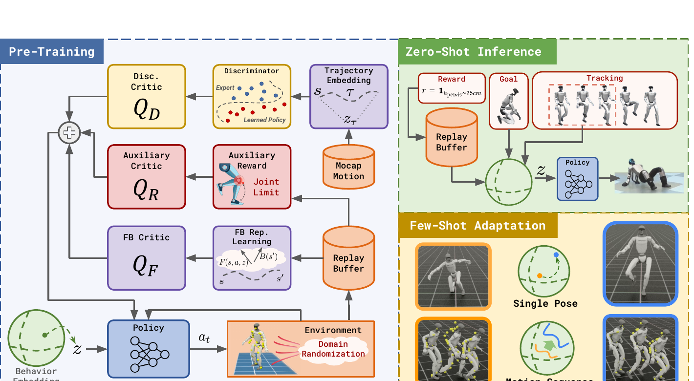

<!--
---
id: P0046
title_en: "BFM-Zero: A Promptable Behavioral Foundation Model for Humanoid Control Using Unsupervised Reinforcement Learning"
title_zh: "BFM-Zero：基于无监督强化学习、可提示的人形机器人行为基础模型"
year: 2025
date: 2025-11-06
venue: "arXiv preprint arXiv:2511.04131"
primary_category: locomotion-prior
tags:
  - motion-prior
  - reinforcement-learning
  - adversarial-learning
  - motion-tracking
  - whole-body-control
  - zero-shot
  - generalization
  - motion-capture
  - robot-state
  - g1
  - isaac-lab
  - mujoco
  - sim2sim
  - sim2real
authors:
  - Yitang Li
  - Zhengyi Luo
  - Tonghe Zhang
  - Cunxi Dai
  - Anssi Kanervisto
  - Andrea Tirinzoni
  - Haoyang Weng
  - Kris Kitani
  - Mateusz Guzek
  - Ahmed Touati
  - Alessandro Lazaric
  - Matteo Pirotta
  - Guanya Shi
institutions:
  - Carnegie Mellon University
  - Meta
paper_url: "https://arxiv.org/abs/2511.04131"
project_url: "https://lecar-lab.github.io/BFM-Zero/"
github_url: "https://github.com/LeCAR-Lab/BFM-Zero"
video_url: null
open_source:
  code: full
  training_code: full
  inference_code: full
  model_weights: full
  dataset: full
  robot_deployment: full
open_source_checked: 2026-09-04
robots:
  - Unitree G1
  - Booster T1
inputs:
  - robot proprioception and action history
  - reward prompt, goal pose, or motion sequence
outputs:
  - latent-conditioned joint targets
read_status: deep-read
reproduce_status: not-started
local_materials:
  - "local_archive/P0046/bfm-zero.pdf"
created: 2026-09-04
updated: 2026-09-04
---
-->

# P0046｜BFM-Zero：基于无监督强化学习、可提示的人形机器人行为基础模型

*BFM-Zero: A Promptable Behavioral Foundation Model for Humanoid Control Using Unsupervised Reinforcement Learning*

[论文](https://arxiv.org/abs/2511.04131) · [项目页](https://lecar-lab.github.io/BFM-Zero/) · [官方代码](https://github.com/LeCAR-Lab/BFM-Zero)

## 基本信息

<!-- AUTO-BASIC-INFO:START -->
> **作者**：Yitang Li、Zhengyi Luo、Tonghe Zhang、Cunxi Dai、Anssi Kanervisto、Andrea Tirinzoni、Haoyang Weng、Kris Kitani、Mateusz Guzek、Ahmed Touati、Alessandro Lazaric、Matteo Pirotta、Guanya Shi
>
> **机构**：Carnegie Mellon University、Meta
>
> **论文时间**：2025-11-06
>
> **期刊 / 会议**：arXiv preprint arXiv:2511.04131
>
> **主分类**：Locomotion 与运动先验
>
> **重点标签**：**运动先验** · **强化学习** · **对抗学习** · **动作跟踪** · **全身控制** · **零样本** · **泛化** · **动作捕捉** · **机器人状态** · **Unitree G1** · **Isaac Lab** · **MuJoCo** · **Sim2Sim** · **Sim2Real**
>
> **阅读状态**：已精读　·　**复现状态**：未开始
<!-- AUTO-BASIC-INFO:END -->

### 资料与开源说明

- 论文于 2025-11-06 首次公开，当前出版信息为 arXiv 预印本。
- 截至 2026-09-04，官方仓库已提供完整训练/评估、预训练模型、数据、sim2sim/sim2real 和精简推理分支；RTX 4090 友好的最小训练实现仍列在 TODO，但不影响“论文主训练管线已公开”的判断。
- 仓库许可为 CC BY-NC 4.0，而非宽松软件许可证；商用、再分发和衍生使用需单独核对许可条款。

## 本文贡献

- 用无监督 forward–backward 表征学习一个连续行为潜空间，使同一 humanoid policy 能从奖励函数、单帧目标姿态或整段轨迹生成行为 embedding，而无需针对每项任务重新训练权重。
- 将动作判别器和关节安全辅助 critic 融入 FB actor 目标，在奖励自由探索中维持类人动作分布与关节约束，避免纯无监督行为覆盖退化成不安全姿态。
- 提供零样本奖励优化/目标到达/动作跟踪，以及仅在潜变量上做 CEM 等少样本搜索的统一接口，并在 G1、Booster T1 与跨仿真环境中验证。

## 研究问题

传统 tracker 每个参考都需要显式跟踪奖励，技能适配通常要微调策略；生成式动作先验又不一定学到可实时执行的控制。BFM-Zero 研究能否只用无标签动作与在线环境转移学习一个“行为坐标系”，让新任务通过计算或搜索一个低维 `z` 来提示同一策略，同时保持类人性、关节安全和 sim2real 鲁棒性。

## 原论文重点图

**图 1：BFM-Zero 预训练、零样本提示与少样本适配（原论文 Figure 2）。** 左侧策略在行为 embedding `z` 条件下与随机化环境交互；FB critic 学习 forward/backward 表征，判别器 critic 提供类人性信号，辅助 critic 约束关节安全。右上将奖励、目标姿态或轨迹通过 backward 表征变成 `z` 后直接运行同一策略；右下只搜索 `z` 以贴合单姿态或动作序列，不更新策略网络。

## 研究方法详细解读

### 总体流程：预训练一个行为坐标系，任务只负责选坐标

BFM-Zero 的核心不是先训练 tracker 再换奖励微调，而是一次性学习 `π(a|o,z)`。训练时从 replay buffer 采样状态转移和无标签动捕，FB 模块学习“给定行为方向 z，哪些转移会被策略访问”；判别器约束动作像动捕，辅助奖励处理关节安全；policy 在各种 z 下收集新数据。推理时将奖励、目标或轨迹映射为 z，策略权重冻结。少样本适配也只用 CEM/退火搜索 z，不做梯度微调。critic、判别器和 replay buffer 均不部署。

### 整体训练主线：无奖励预训练到三类提示

1. 将 LAFAN1 无标签动作重定向到 29-DoF humanoid，保存可供 backward encoder 使用的状态轨迹。
2. 在 IsaacLab/MuJoCo 并行环境中按随机行为 embedding `z` 执行策略，持续写入 transition replay buffer。
3. 用 FB-CPR 目标训练 forward 表征 `F(s,a,z)` 与 backward 表征 `B(s)`，让其内积描述 z 条件下的长期访问结构。
4. 同时训练动作判别器和关节限制辅助 critic，把类人性与安全回报加入 actor 更新。
5. 对新奖励直接由 replay 状态加权平均 `B(s)` 得到 z；对目标姿态取 `B(s_goal)`；对轨迹聚合未来状态表征。
6. 若零样本 z 不够精确，仅在潜空间用 CEM 等黑盒搜索，不改变模型参数。

### 状态、动作与特权观测

机器人动作是 29 维 PD 目标。可观测状态约 64 维，由相对默认姿态的关节角、关节速度、根旋转/角速度和投影重力组成，并与历史动作形成窗口；根高度与全局位置等部署不可得量不送入 actor。训练完整状态约 463 维，包含 link、根线速度等仿真特权信息，供 critic/表征学习使用。论文明确排除全局根位置和朝向，让同一行为潜变量可跨场地执行，但也意味着需要绝对位置的任务必须由外部目标或估计器闭环。

### Forward–Backward 表征的含义

backward encoder `B(s)` 把状态映射到行为特征；forward encoder `F(s,a,z)` 预测在当前状态动作和条件 z 下未来访问分布的特征。二者内积近似折扣占用结构：若某个 z 与一类状态的 B 表征对齐，策略会倾向访问这些状态。FB critic `Q_F` 用离策略转移学习这一关系，policy 则最大化 `F^T z`。因此 z 不是动作压缩码，而是“希望长期访问哪类状态/转移”的方向，能统一奖励优化、目标到达和轨迹跟踪。

### 判别器与辅助安全 critic

纯 FB 目标鼓励覆盖不同状态，但不保证姿态类人或关节安全。判别器比较动捕专家状态与策略状态，产生 CPR/对抗式类人性信号，判别器 critic `Q_D` 把它传给 actor。另一辅助奖励直接惩罚关节接近或超过限制，由 `Q_R` 建模。actor 目标将 `Q_F`、加权 `Q_D` 和 `Q_R` 合并；三者分别承担行为可提示性、动作自然度和安全正则。训练时梯度经过各 critic 更新 policy，推理只需 policy 和 z。

### 离策略 replay、非对称网络与随机化

BFM-Zero 使用大规模并行环境收集数据，却通过 replay 与较高 update-to-data ratio 重复利用转移，比每次丢弃 rollout 的 PPO 更适合无监督探索。actor 只读部署观测历史，critic 读取 463 维特权状态；环境随机化质量、摩擦、PD 与扰动，训练动作频率约 50 Hz、仿真更高频。行为 z 在训练中广泛采样，使 replay 同时包含站立、移动、转身和不同姿态，而动捕轨迹为判别器/backward 空间提供人类动作支撑。

### 零样本奖励、目标与轨迹提示

给定状态奖励 `r(s)`，从 replay 取样并计算 `z_r ∝ Σ B(s)r(s)`，即可把“骨盆高于 25 cm”等目标投影到行为空间；目标姿态直接用 `z_g=B(s_g)`；轨迹跟踪则聚合未来序列的 B 表征得到随时间变化或窗口化 z。三者都不更新权重。提示质量取决于 replay 是否覆盖相关状态和 B 表征是否分辨任务，所谓 zero-shot 指策略参数不更新，不表示任务信息、目标状态或参考轨迹为零输入。

### 少样本潜空间搜索

当一个目标姿态或轨迹不能由解析投影精确表示时，作者固定 policy，在 z 空间运行候选并按任务代价打分。单姿态使用 CEM 迭代更新候选分布；动作序列使用带双重退火的轨迹潜变量搜索，在探索和时间平滑之间折中。搜索完成得到 z 或 z 序列，再由原 policy 执行。它比微调百万参数网络样本更省，但仍需要仿真 rollout，且仿真目标最优 z 未必直接满足真实机器人安全。

### 推理、控制与跨平台部署

在线周期读取本体历史和当前 z，policy 输出 29 维关节目标，PD 闭环执行。奖励/目标/轨迹到 z 的计算可离线或低频进行，真正高频控制不运行 FB critics。作者在 IsaacLab 训练、MuJoCo 评测，并在 Unitree G1 与 Booster T1 部署，说明潜变量条件 actor 可跨两类平台流程使用；每个平台仍需各自资产、关节映射、观测归一化和 checkpoint，不能把“一个方法”理解成同一二进制模型跨机器人。

### 部署边界与复现契约

复现必须固定 29 关节顺序、64D 可观测/463D 特权字段、历史长度、根坐标约定、LAFAN1 处理、FB 归一化、z 维度与采样分布、判别器权重、辅助关节限制、replay/UTD、域随机化、PD 和目标投影。少样本结果还依赖 CEM 人口、迭代和仿真代价。当前仓库虽已发布全训练管线，许可为非商业，且本页没有运行任何分支；论文跨仿真/实机结果不能替代独立硬件验证。

## 实验结果与结论

### 实验设置

- 预训练：LAFAN1 无标签动作、离策略 FB-CPR、对抗类人性与关节安全辅助目标。
- 下游：零样本奖励最大化、单姿态目标、动作跟踪；少样本单姿态/序列适配。
- 平台：IsaacLab 训练，MuJoCo 跨仿真，Unitree G1 与 Booster T1 实机。

### 主要结果

- 少样本 CEM 在约 20 轮中找到单腿挂 4 kg 等姿态，保持时间超过 15 秒，而无适配基线在 5 秒内碰撞/失败。
- 序列潜空间适配相对零样本把轨迹误差降低约 29.1%，说明同一 policy 的 z 空间可进一步任务化。
- 结果支持“冻结策略、提示 z”在论文任务上的灵活性；不证明 replay 未覆盖的任意接触任务都能通过潜变量搜索获得。

## 局限与复现提醒

- **覆盖边界：** 可提示任务仍受预训练 replay 与动捕支撑限制，真正分布外接触可能没有可用 z。
- **搜索边界：** 少样本适配没有更新权重，但需要仿真 rollout 与任务代价，不是零计算适配。
- **许可边界：** CC BY-NC 4.0 限制商业使用，使用代码/权重前需核对条款。
- **验证边界：** 本页只完成论文和当前仓库精读，未运行训练、CEM、sim2sim 或实机。

## 阅读与复现状态

- 阅读：已精读论文方法、提示构造、实验与附录。
- 资源：已核验训练、数据、权重和部署分支以及许可。
- 复现：未开始，未加载公开 checkpoint。

## 参考资料

- [arXiv 论文页](https://arxiv.org/abs/2511.04131)
- [官方项目页](https://lecar-lab.github.io/BFM-Zero/)
- [官方代码](https://github.com/LeCAR-Lab/BFM-Zero)

## 更新记录

- 2026-09-04：创建 P0046 精读档案；核验作者机构、当前完整训练发布与非商业许可；收录原论文 Figure 2，详细解读 FB 表征、双辅助 critic、三类零样本提示、潜空间少样本搜索和部署契约。
