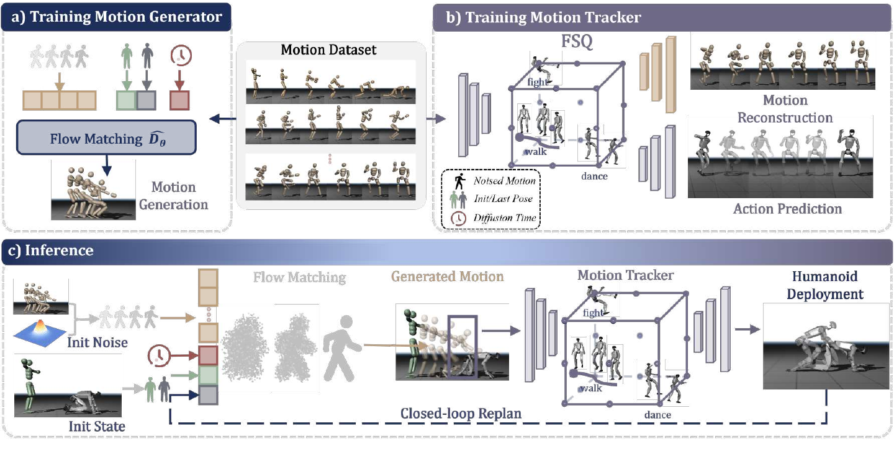

<!--
---
id: P0047
title_en: "Heracles: Bridging Precise Tracking and Generative Synthesis for General Humanoid Control"
title_zh: "Heracles：连接精确跟踪与生成式合成的通用人形机器人控制"
year: 2026
date: 2026-03-29
venue: "arXiv preprint arXiv:2603.27756"
primary_category: tracking-wbc
tags:
  - motion-tracking
  - whole-body-control
  - motion-generation
  - flow-matching
  - transformer
  - reinforcement-learning
  - motion-prior
  - fall-recovery
  - robot-state
  - humanoid
  - sim2real
  - real-time
authors:
  - Zelin Tao
  - Zeran Su
  - Peiran Liu
  - Jingkai Sun
  - Wenqiang Que
  - Jiahao Ma
  - Jialin Yu
  - Jiahang Cao
  - Pihai Sun
  - Hao Liang
  - Gang Han
  - Wen Zhao
  - Zhiyuan Xu
  - Jian Tang
  - Qiang Zhang
  - Yijie Guo
institutions:
  - X-Humanoid Heracles Project Team
paper_url: "https://arxiv.org/abs/2603.27756"
project_url: "https://heracles-humanoid-control.github.io/"
github_url: null
video_url: null
open_source:
  code: "no"
  training_code: "no"
  inference_code: "no"
  model_weights: "no"
  dataset: "no"
  robot_deployment: "no"
open_source_checked: 2026-09-04
robots:
  - X-Humanoid full-size humanoid
inputs:
  - current robot state
  - original reference motion
  - discrete motion embedding
outputs:
  - short-horizon feasible keyframes
  - joint actions through a motion tracker
read_status: deep-read
reproduce_status: not-started
local_materials:
  - "local_archive/P0047/heracles.pdf"
created: 2026-09-04
updated: 2026-09-04
---
-->

# P0047｜Heracles：连接精确跟踪与生成式合成的通用人形机器人控制

*Heracles: Bridging Precise Tracking and Generative Synthesis for General Humanoid Control*

[论文](https://arxiv.org/abs/2603.27756) · [项目页](https://heracles-humanoid-control.github.io/) · 代码待公开

## 基本信息

<!-- AUTO-BASIC-INFO:START -->
> **作者**：Zelin Tao、Zeran Su、Peiran Liu、Jingkai Sun、Wenqiang Que、Jiahao Ma、Jialin Yu、Jiahang Cao、Pihai Sun、Hao Liang、Gang Han、Wen Zhao、Zhiyuan Xu、Jian Tang、Qiang Zhang、Yijie Guo
>
> **机构**：X-Humanoid Heracles Project Team
>
> **论文时间**：2026-03-29
>
> **期刊 / 会议**：arXiv preprint arXiv:2603.27756
>
> **主分类**：动作跟踪与全身控制
>
> **重点标签**：**动作跟踪** · **全身控制** · **动作生成** · **流匹配** · **Transformer** · **强化学习** · **运动先验** · **跌倒恢复** · **机器人状态** · **人形机器人** · **Sim2Real** · **实时**
>
> **阅读状态**：已精读　·　**复现状态**：未开始
<!-- AUTO-BASIC-INFO:END -->

### 资料与开源说明

- 论文 2026-03-29 首次公开；本页阅读的是 2026-03-31 更新的 arXiv v2，日期按首次公开登记。
- 论文首页以 X-Humanoid Heracles Project Team 为团队署名，官方项目页列出成员；机构字段保留官方团队名称，不从个人履历推断额外单位。
- 截至 2026-09-04，项目页代码仍标注 Coming Soon，没有可核验仓库、模型、数据或部署资源，开源各项登记为“未公开”。

## 本文贡献

- 将通用动作控制重新表述为“状态条件轨迹生成中间层 + 高频动作跟踪器”：名义状态尽量保持原参考，受大扰动时生成过渡与恢复动作。
- 用条件流匹配每 0.2 秒生成 8 个短时域关键帧，并通过定向 warm start、少步 Euler 求解和闭环重规划满足 25 Hz 在线预算。
- 为低层 tracker 引入带精确零中心的 FSQ 动作离散表征、动作重建/预测联合训练和困难时间窗采样，在精确跟踪与跌倒恢复间建立共享语义空间。

## 研究问题

纯参考跟踪器在正常状态下精确，却在大扰动后仍执着追赶已经不可达的参考，常产生僵硬或灾难性动作；纯生成器更灵活，却可能损失命令精度和实时性。Heracles 研究如何让生成模型只在需要时改变参考，并不断依据机器人状态重规划，再由一个理解动作语义的 tracker 高频执行，使正常跟踪和恢复不必由两个完全独立控制器切换。

## 原论文重点图

**图 1：Heracles 两类训练与闭环推理（原论文 Figure 2）。** 上左从动作数据训练状态条件流匹配生成器；上右用同一动作数据训练带 FSQ 表征的 tracker，重建动作并预测关节控制。下方推理时以当前状态、原参考、时间条件和定向噪声为起点，生成一段可行关键帧；tracker 执行后把新状态回送生成器，形成 receding-horizon 重规划。生成器不是一次生成整场动作，tracker 也不是盲目追原参考。

## 研究方法详细解读

### 总体流程：低频改写短参考，高频闭环执行

Heracles 的核心不是在 tracker 动作上加一个局部 residual，而是在参考与 tracker 之间插入生成式 middleware。训练分两条离线支路：流匹配模型学习“当前状态 + 原参考 → 可行短时关键帧”，tracker 学习“本体状态 + 关键帧 + 离散动作语义 → 关节动作”。部署时生成器 25 Hz 重规划 8 个关键帧，插值后交给 50 Hz tracker，PD 以 200 Hz 执行；新状态持续回馈下一次生成。训练期重建头、critic 和干净动作标签不部署。

### 整体训练主线：生成器与 tracker 分别训练、在线串联

1. 将统一机器人动作数据切成当前状态、短时未来关键帧和原始参考组合，构造生成器监督。
2. 训练条件流匹配 Transformer，使噪声关键帧沿速度场还原真实可行未来。
3. 用相同动作数据训练 FSQ encoder/decoder，令离散动作语义同时支持运动重建与控制动作预测。
4. 在 PPO 中训练 tracker，加入带噪参考、状态扰动、动作跟踪奖励和困难时间窗采样。
5. 推理以定向 warm start 和 5 步 Euler 解流，每 0.2 秒生成 8 个关键帧并连续插值。
6. tracker 高频执行，生成器根据最新状态闭环改写后续参考，直到回到原动作流形。

### 状态条件关键帧表示

生成器输入当前机器人状态 `p_t`、原参考 `m_t`、扩散/流时间与初始噪声，输出 `K=8` 个关键帧残差。关键帧以相对当前状态的形式表示，减轻全局位置漂移和不同起点造成的分布跨度；每帧间隔约 0.2 秒，覆盖恢复所需的短时域。名义状态下残差接近零，生成器近似恒等映射；受扰后可偏离原参考形成蹲撑、迈步或起身过渡，再逐步接回参考。

### 条件流匹配生成器

训练在真实未来关键帧 `x_0` 与高斯噪声 `x_1` 间构造线性路径 `x_t=(1-t)x_0+t x_1`，Transformer 预测沿路径的速度场。条件通过自适应层归一化注入当前状态、原参考和时间；损失是预测速度与解析目标速度的均方误差。由于目标是状态条件未来而非无条件动作，模型可以根据当前倾斜、接触与动量生成不同恢复。生成器只学轨迹层，不直接输出关节力矩。

### 定向 warm start 与五步求解

每次从纯随机噪声开始会带来相邻重规划抖动。Heracles 先用当前状态到目标参考的线性/姿态插值得到方向性初值，再在较高噪声时刻约 `t=0.9` 注入随机性；首个残差 token 固定为零，保证新轨迹从当前状态连续出发。在线仅做约 5 个 Euler 步，而非长扩散链。生成关键帧后，关节用三次插值、根旋转用 SLERP 密化，供 tracker 高频读取。

### FSQ 动作语义与精确零中心

tracker 不只看连续参考，还用 FSQ 把动作片段压为离散语义 `z_d`。标准 FSQ 的量化级不一定包含严格零，静止/微小动作会产生偏置；Heracles 调整量化使中心恰为零。编码器共享后分两个头：重建头恢复动作序列，动作预测头结合本体与参考输出控制。重建让 token 保留完整动作结构，控制损失让 token 对动力学执行有用，避免离散码只按视觉相似聚类。

### Tracker 观测、PPO 与辅助目标

tracker 读取当前本体感知、密化后的未来参考和 FSQ 动作 embedding，另使用约十帧本体历史与十帧未来动作上下文。actor 输出关节目标；critic 读取训练特权状态。PPO 奖励包含根/身体/关节跟踪和控制正则，FSQ 重建/动作预测提供辅助监督。训练向状态或参考加入噪声，让 tracker 学会从生成器不完美输出中恢复；原参考保持干净，用于定义动作语义和目标，而不是让噪声同时污染两端。

### 自适应困难时间窗采样

普通均匀采样会把大量站立和周期步态反复送入训练。Heracles 按时间 bin 维护失败/误差统计，提高困难窗口抽样概率，使落地、接触切换和恢复片段获得更多更新。采样难度与 PPO tracking 回报联动，但不改变原数据本身。它和生成器分工不同：tracker 困难采样提高局部执行能力，生成器负责在当前参考不可达时产生新的短轨迹。

### 在线闭环重规划与双频率控制

生成中间层约 25 Hz 更新，每次观察最新机器人状态并输出 8 个关键帧；tracker 约 50 Hz 读取插值参考，PD 约 200 Hz 执行。每次只执行规划前端，后续关键帧随新状态重算。名义动作中 warm start 和零残差维持高保真；摔倒或推扰中，生成器可以在若干重规划周期内产生支撑、滚转、起身并重新接入动作。该结构允许生成器比低层控制慢，却仍保持闭环。

### 部署状态、全局量与复现契约

论文仿真表示约 38 维，包含全局根量；实机版本约 35 维，去除不可可靠获得的全局信息。生成器约 22.9M 参数，tracker 在大规模并行环境中训练；论文报告生成器/控制都满足实时频率。复现必须锁定状态维度、根坐标、K=8、0.2 秒间隔、warm-start 噪声时刻、5 步 Euler、插值、FSQ 级别/零中心、历史与未来窗口、tracker checkpoint 和 PD。代码未公开，本页无法核验实现或运行结果。

## 实验结果与结论

### 实验设置

- 任务：名义动作跟踪、外力扰动、分布外状态与跌倒恢复；比较 tracker、VQ-VAE/生成基线及方法消融。
- 指标：完成率/恢复率、动作跟踪误差、真实全尺寸人形演示。
- 消融：训练噪声、运动学加权、warm start、FSQ/生成模块。

### 主要结果

- 完整模型完成率约 90.6%；去掉状态噪声约 78.6%，去掉运动学加权约 82.1%，去掉 warm start 约 87.2%，说明三者分别贡献鲁棒性与连续性。
- 跌倒恢复完成率约 90%，高于论文 VQ-VAE 对照约 69.8%，而纯跟踪器低于约 45%。
- 结果支持短时生成中间层在论文扰动协议中的价值；没有公开代码和足够长期硬件统计，不能据此断言任意摔倒都安全可恢复。

## 局限与复现提醒

- **全局状态差异：** 仿真与实机状态维度不同，移除全局量后的估计与性能不可默认等价。
- **模型串联：** 生成器、插值器、FSQ tracker 和 PD 是同一契约，单独复现某一模块不能代表完整 Heracles。
- **开源边界：** 代码、权重、数据和部署脚本尚未公开，当前只能依据论文方法复核。
- **安全边界：** 恢复演示不构成真实机器人主动摔倒测试授权或安全保证。

## 阅读与复现状态

- 阅读：已精读论文与附录，核对官方项目页。
- 资源：截至核验日仍为代码待公开。
- 复现：未开始，未运行仿真、模型或实机。

## 参考资料

- [arXiv 论文页](https://arxiv.org/abs/2603.27756)
- [官方项目页](https://heracles-humanoid-control.github.io/)

## 更新记录

- 2026-09-04：创建 P0047 精读档案；核验团队署名、首次公开日期与代码状态；收录原论文 Figure 2，详细解读条件流匹配中间层、定向 warm start、FSQ tracker、闭环重规划与恢复边界。
