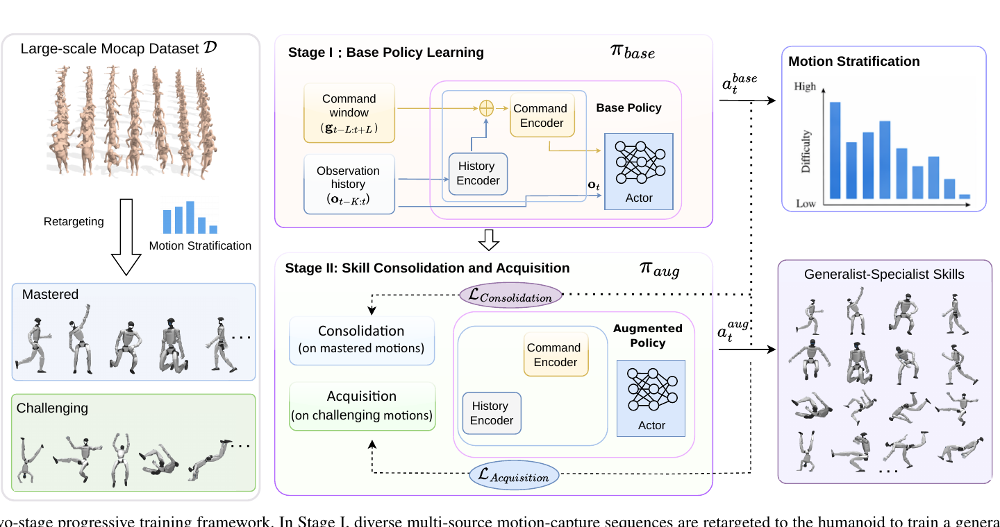

<!--
---
id: P0048
title_en: "Extreme-RGMT: Continual Learning of Highly Dynamic Skills for Robust Generalist Humanoid Control"
title_zh: "Extreme-RGMT：面向鲁棒通用人形控制的高动态技能持续学习"
year: 2026
date: 2026-07-22
venue: "arXiv preprint arXiv:2607.20110"
primary_category: tracking-wbc
tags:
  - motion-tracking
  - whole-body-control
  - reinforcement-learning
  - continual-learning
  - curriculum-learning
  - transformer
  - motion-capture
  - robot-state
  - g1
  - sim2real
  - real-time
  - generalization
authors:
  - Yubiao Ma
  - Han Yu
  - Kai Guo
  - Changtai Lv
  - Zhengquan Mao
  - Boyang Xing
  - Xuemei Ren
  - Dongdong Zheng
institutions:
  - Beijing Institute of Technology
  - Humanoid Robotics (Shanghai) Co., Ltd.
  - Shandong University
paper_url: "https://arxiv.org/abs/2607.20110"
project_url: "https://zeonsunlightyu.github.io/Extreme-RGMT.github.io/"
github_url: null
video_url: null
open_source:
  code: "no"
  training_code: "no"
  inference_code: "no"
  model_weights: "no"
  dataset: "no"
  robot_deployment: "no"
open_source_checked: 2026-09-04
robots:
  - Unitree G1
inputs:
  - robot proprioception history
  - local reference command window
outputs:
  - residual joint position targets
read_status: deep-read
reproduce_status: not-started
local_materials:
  - "local_archive/P0048/extreme-rgmt.pdf"
created: 2026-09-04
updated: 2026-09-04
---
-->

# P0048｜Extreme-RGMT：面向鲁棒通用人形控制的高动态技能持续学习

*Extreme-RGMT: Continual Learning of Highly Dynamic Skills for Robust Generalist Humanoid Control*

[论文](https://arxiv.org/abs/2607.20110) · [项目页](https://zeonsunlightyu.github.io/Extreme-RGMT.github.io/) · 代码待公开

## 基本信息

<!-- AUTO-BASIC-INFO:START -->
> **作者**：Yubiao Ma、Han Yu、Kai Guo、Changtai Lv、Zhengquan Mao、Boyang Xing、Xuemei Ren、Dongdong Zheng
>
> **机构**：Beijing Institute of Technology、Humanoid Robotics (Shanghai) Co., Ltd.、Shandong University
>
> **论文时间**：2026-07-22
>
> **期刊 / 会议**：arXiv preprint arXiv:2607.20110
>
> **主分类**：动作跟踪与全身控制
>
> **重点标签**：**动作跟踪** · **全身控制** · **强化学习** · **持续学习** · **课程学习** · **Transformer** · **动作捕捉** · **机器人状态** · **Unitree G1** · **Sim2Real** · **实时** · **泛化**
>
> **阅读状态**：已精读　·　**复现状态**：未开始
<!-- AUTO-BASIC-INFO:END -->

### 资料与开源说明

- 论文于 2026-07-22 首次公开，当前出版信息为 arXiv 预印本。
- 机构名称按原论文首页登记：Beijing Institute of Technology、Humanoid Robotics (Shanghai) Co., Ltd. 与 Shandong University，不依据简称自行扩写法人名称。
- 截至 2026-09-04，项目页提供论文、视频和结果说明，未发现官方代码、权重、数据或部署仓库，开源各分项登记为“未公开”。

## 本文贡献

- 在已有 RGMT 通用 tracker 上提出两阶段持续学习：先学广覆盖基础策略，再只针对约 0.28 小时高难动作进行技能获取，同时用已掌握动作约束遗忘。
- 提出 PACE，将环境预算的 80% 分配给困难动作获取、20% 用于已掌握动作巩固，并依据在线进度自动调节参考策略动作模仿权重。
- 提出 STAR，在 transition 级别按动作难度和优势值寻找每个 bin 最关键的连续片段，重采样稀有高动态接触和落地信号。

## 研究问题

一个通用 tracker 能覆盖走路、舞蹈和日常动作，却常在后空翻、空中旋转、快速落地等分布尾部失败；直接用这些动作继续训练又会破坏原本稳定的普通技能。Extreme-RGMT 研究如何在不保存完整旧训练流程的情况下，用少量高动态数据获得 specialist 能力，同时通过参考策略和分层采样保留 generalist 能力。

## 原论文重点图

**图 1：两阶段持续学习框架（原论文 Figure 2）。** 左侧多源动作经重定向与 rollout 分层，分为已掌握和困难动作。阶段 I 用全部分布训练基础策略 `π_base`；阶段 II 初始化增强策略 `π_aug`，绿色 acquisition 分支在困难动作上用 PPO 获得新技能，蓝色 consolidation 分支在已掌握动作上约束输出接近基础策略。右侧表示训练后既保留普通动作，又扩大到翻转、落地等高动态技能。

## 研究方法详细解读

### 总体流程：先量出“不会什么”，再在不忘旧技能的前提下专攻

Extreme-RGMT 的核心不是把所有动作重新混合训练，而是先固定一个 generalist 作为能力基线。阶段 I 用 3.096 小时多源动作训练 RGMT 基础策略；随后对每个 10 秒 clip 多次 rollout，以成功率分为 mastered 与 challenging；阶段 II 从基础权重初始化增强策略，PACE 把大多数环境用于困难动作 PPO、少数用于旧动作模仿巩固，STAR 再把困难 rollout 中最有学习价值的连续 transition 提高采样。部署只保留增强 actor；基础 actor、critic、分层统计和重采样器都只在训练期使用。

### 整体训练主线：基础学习、动作分层、持续适配

1. 汇总 LAFAN1、AMASS 和 Xsens 自采动作，重定向到 Unitree G1 并训练 RGMT 基础策略。
2. 将数据切成约 10 秒 clip，每段运行五次，成功率至少 80% 记为 mastered，否则记为 challenging。
3. 冻结 `π_base` 作为参考，以其权重初始化 `π_aug`；80% 环境自适应采困难动作，20% 环境均匀采旧动作。
4. 困难环境按 PPO acquisition 回报更新，旧动作环境最小化增强策略与基础策略动作差异。
5. PACE 依据困难样本有效学习进度调整巩固系数，STAR 从各难度 bin 提取高优势连续片段重采样。
6. 训练完成丢弃参考策略和采样模块，将单一 `π_aug` 以 50 Hz 部署到 G1。

### 多源动作数据与能力分层

训练动作共约 3.096 小时：LAFAN1 约 2.444 小时、AMASS 约 0.511 小时、Xsens 自采约 0.141 小时。基础策略评测后约 2.82 小时归为 mastered、0.28 小时归为 challenging。划分依据不是动作名称或人工标签，而是当前基础策略在多次 rollout 中能否达到至少 80% 成功率，因此它随基础 checkpoint、终止条件和机器人资产变化。换一个基础策略必须重新分层，不能沿用论文清单。

### RGMT 基础策略结构

策略继承 RGMT：历史 encoder 对过去本体感知/动作序列做因果多头注意力，得到动力学 embedding；局部参考命令窗口经另一个 encoder 编码，并用历史表示作为 query 做 cross-attention，选择当前最相关的过去/未来参考；当前观测、动力学和命令 embedding 进入 actor，输出相对参考关节角的残差。Extreme-RGMT 不靠替换主干获得高动态能力，创新重点是阶段 II 的训练分布与损失。

### PACE 的环境预算分配

Progress-Adaptive Consolidation and Exploration 将约 80% 并行环境分给 acquisition、20% 分给 consolidation。acquisition 环境从 challenging 集中按近期表现自适应采样，优先仍失败但可进步的动作；consolidation 环境从 mastered 集均匀采样，防止只保留少数旧技能。两类环境可在同一批 rollout 中并行，分别计算 PPO 回报与参考动作误差，再共同更新增强策略。

### 自适应巩固权重与冻结参考策略

基础策略在阶段 II 全程冻结，只为 mastered 状态给出参考动作 `a_base`。增强策略对困难动作优化 PPO acquisition 损失，对旧动作增加动作模仿损失 `||a_aug-a_base||`。巩固权重不是常数：论文用有效 acquisition 样本比例的指数滑动平均描述进度，再围绕参考进度约 0.6、基础权重约 0.3 和斜率约 5 调节，EMA 系数约 0.99。新技能尚无有效梯度时不会被过强旧策略束缚，获取开始稳定后逐渐加大防遗忘约束。

### STAR 的 transition 难度与优势筛选

高动态动作的关键学习信号集中在起跳、腾空调整、接触切换和落地几帧。STAR 先把 transition 按运动难度分 bin，用 bin 概率形成难度权重；为防高难样本大负优势淹没普通样本，高难与其他样本分别归一化优势。每个 bin 再找原始优势最高约 5% 的连续片段，组成专项 replay；训练批次约 25% 来自这些片段，并按难度加权。它不是一般离策略 replay，而是 on-policy 数据内的结构化重采样。

### PPO acquisition 与旧技能 consolidation 如何合并

acquisition 分支用 clipped PPO、价值与熵等常规项从困难动作学习；consolidation 分支不要求新策略复制基础 critic，只约束 actor 在旧动作状态下保持相近输出。两者在增强策略参数上汇合。若完全移除 consolidation，普通动作可能退化；若固定很大模仿权重，增强策略会被基础动作限制，无法完成翻转。PACE 的进度权重和环境比例共同控制稳定—可塑性权衡。

### 推理与真实 G1 部署

训练结束只导出增强 actor，输入仍是本体历史和局部参考窗口，输出残差关节目标；不需要在线判断 mastered/challenging，也不运行基础 actor。论文真实 G1 策略约 50 Hz，低层 PD 约 500 Hz，并用在线 Xsens 参考测试高动态遥操作。观测不含全局位置/朝向，有利于无需定位部署，却会产生全局漂移；参考命令必须在局部根坐标中按相同约定更新。

### 部署边界与复现契约

复现必须固定 RGMT 基础 checkpoint、3.096 小时数据与重定向、10 秒 clip、五次 rollout、80% 分层阈值、成功/终止定义、PACE 的 80/20 环境比例、EMA/进度参数、STAR bin 和 5% 连续片段、25% 混入比例、关节残差、历史/命令窗口、PD 与 G1 资产。阶段 II 的结果高度依赖基础策略“已经会什么”；没有官方代码时无法核验采样细节。本页也未运行任何训练或实机。

## 实验结果与结论

### 实验设置

- 数据：LAFAN1、AMASS 与 Xsens；普通/高动态动作分层，含来源外动作。
- 对比：阶段 I 基础策略、只做专项训练、PACE/STAR 消融与完整 Extreme-RGMT。
- 指标：通用源数据成功率、未见动作成功率、困难动作和真实 Xsens 高动态执行率。

### 主要结果

- 完整策略在通用源数据上约 99.76%、未见动作约 96.68%，说明专项学习没有明显破坏广覆盖能力。
- specialist Xtreme 子集约 100%，AMASS challenging 约 90.91%，而阶段 I 对应约 21.42%/18.18%，显示阶段 II 专门化收益巨大。
- Xsens 高动态数据中 STAR 带来约 40.8 个百分点增益；真实在线 Xsens 高动态成功率约 85%。这些数字依赖论文成功判定与动作集，不能外推到任意特技。

## 局限与复现提醒

- **持续学习边界：** 方法依赖冻结基础策略和旧动作采样，并非无需旧数据的严格 continual learning。
- **漂移边界：** actor 不使用全局位置/朝向，长时轨迹可能积累全局漂移。
- **开源边界：** 代码、checkpoint、数据划分和部署实现尚未公开，无法复核论文阈值实现。
- **安全边界：** 高动态真实演示不代表可在无防护环境复现；本页未做硬件测试。

## 阅读与复现状态

- 阅读：已精读论文方法、PACE、STAR、实验和附录。
- 资源：已核验项目页与当前未开源状态。
- 复现：未开始，未运行训练、仿真或 G1。

## 参考资料

- [arXiv 论文页](https://arxiv.org/abs/2607.20110)
- [官方项目页](https://zeonsunlightyu.github.io/Extreme-RGMT.github.io/)

## 更新记录

- 2026-09-04：创建 P0048 精读档案；核验作者机构、首次公开日期与项目资源；收录原论文 Figure 2，详细解读能力分层、PACE、STAR、巩固—获取损失与 G1 部署边界。
