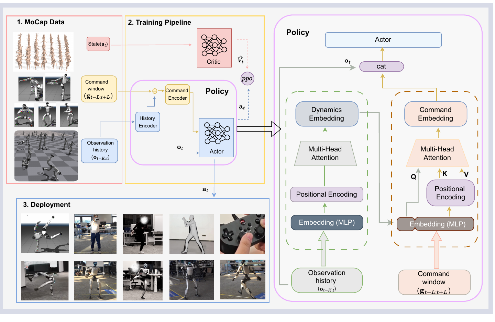

<!--
---
id: P0049
title_en: "Robust and Generalized Humanoid Motion Tracking"
title_zh: "RGMT：鲁棒且泛化的人形机器人动作跟踪"
year: 2026
date: 2026-01-30
venue: "arXiv preprint arXiv:2601.23080"
primary_category: tracking-wbc
tags:
  - motion-tracking
  - whole-body-control
  - reinforcement-learning
  - transformer
  - teleoperation
  - vr
  - motion-capture
  - robot-state
  - g1
  - sim2real
  - real-time
  - generalization
authors:
  - Yubiao Ma
  - Han Yu
  - Jiayin Xie
  - Changtai Lv
  - Qiang Luo
  - Chi Zhang
  - Yunpeng Yin
  - Boyang Xing
  - Xuemei Ren
  - Dongdong Zheng
institutions:
  - Beijing Institute of Technology
  - Humanoid Robotics (Shanghai) Co., Ltd.
paper_url: "https://arxiv.org/abs/2601.23080"
project_url: "https://zeonsunlightyu.github.io/RGMT.github.io/"
github_url: null
video_url: null
open_source:
  code: "no"
  training_code: "no"
  inference_code: "no"
  model_weights: "no"
  dataset: "no"
  robot_deployment: "no"
open_source_checked: 2026-09-04
robots:
  - Unitree G1
inputs:
  - proprioception and previous-action history
  - local reference command window
outputs:
  - residual joint position targets
read_status: deep-read
reproduce_status: not-started
local_materials:
  - "local_archive/P0049/rgmt.pdf"
created: 2026-09-04
updated: 2026-09-04
---
-->

# P0049｜RGMT：鲁棒且泛化的人形机器人动作跟踪

*Robust and Generalized Humanoid Motion Tracking*

[论文](https://arxiv.org/abs/2601.23080) · [项目页](https://zeonsunlightyu.github.io/RGMT.github.io/) · 代码待公开

## 基本信息

<!-- AUTO-BASIC-INFO:START -->
> **作者**：Yubiao Ma、Han Yu、Jiayin Xie、Changtai Lv、Qiang Luo、Chi Zhang、Yunpeng Yin、Boyang Xing、Xuemei Ren、Dongdong Zheng
>
> **机构**：Beijing Institute of Technology、Humanoid Robotics (Shanghai) Co., Ltd.
>
> **论文时间**：2026-01-30
>
> **期刊 / 会议**：arXiv preprint arXiv:2601.23080
>
> **主分类**：动作跟踪与全身控制
>
> **重点标签**：**动作跟踪** · **全身控制** · **强化学习** · **Transformer** · **遥操作** · **虚拟现实** · **动作捕捉** · **机器人状态** · **Unitree G1** · **Sim2Real** · **实时** · **泛化**
>
> **阅读状态**：已精读　·　**复现状态**：未开始
<!-- AUTO-BASIC-INFO:END -->

### 资料与开源说明

- 论文于 2026-01-30 首次公开，当前出版信息为 arXiv 预印本。
- 原论文题名不含缩写展开，本页按用户和官方项目通用名称称为 RGMT；英文题名保持论文原文。
- 截至 2026-09-04，官方项目页提供论文与视频，未发现可核验官方代码、权重、数据或部署仓库，各开源分项登记为“未公开”。

## 本文贡献

- 用因果历史 encoder 从本体感知和上一动作中学习动力学 embedding，再以该 embedding 查询局部参考窗口，使控制器能根据当前运动状态选择最相关的过去/未来命令。
- 以参考关节角加策略残差作为 PD 目标，结合非对称 actor–critic 与密集关键点奖励，在仅约 3.5 小时高质量动作上学习广覆盖跟踪。
- 加入随机不稳定初始化与逐步衰减的向上辅助力训练跌倒恢复，并在噪声参考、视频动作、Pico/动捕遥操作和真实 G1 上验证鲁棒性。

## 研究问题

实际参考可能来自动捕、视频重建或遥操作，带有抖动、丢帧、时序偏差和难以执行的接触转换。只看当前参考的 MLP 无法判断机器人正在加速、落地还是失衡；固定拼接未来窗口又不会根据当前动力学选择信息。RGMT 研究如何用历史状态形成动力学查询，对命令窗口做自适应聚合，并在较小但高质量数据上获得噪声鲁棒和真实部署能力。

## 原论文重点图

**图 1：RGMT 数据、训练、部署与双编码器策略（原论文 Figure 2）。** 左侧动作捕捉/视频等参考形成本体状态和局部命令窗口，actor–critic 用 PPO 训练并部署到多类真实控制入口。右侧历史 encoder 对过去本体感知做因果多头注意力和池化，得到 dynamics embedding；命令 encoder 用它作为 query，对带位置编码的参考窗口做 cross-attention。两种 embedding 与当前观测拼接后进入 actor，输出参考姿态上的残差。

## 研究方法详细解读

### 总体流程：先从历史判断身体怎么动，再决定参考窗口看哪里

RGMT 的核心不是更长地拼接观测，而是建立有方向的信息流：过去本体和动作先编码为动力学状态；这个状态再作为 query 从局部参考窗口中挑选相关命令；最后 actor 结合当前观测输出参考关节残差。训练用 PPO、特权 critic、密集 tracking/safety 奖励，并单独加入恢复初始化与辅助力课程。部署只保留历史 encoder、命令 encoder 和 actor；critic、全局特权状态、辅助力及训练随机化全部移除。

### 整体训练主线：小型精选动作到多入口部署

1. 从 LAFAN1 与精选 AMASS 构建约 3.5 小时紧凑动作集，统一重定向到 Unitree G1 并生成 link/根参考。
2. 每个时间步构造过去 K 帧本体/动作历史和以当前时刻为中心的局部命令窗口。
3. 历史 encoder 学习 dynamics embedding，命令 encoder 以它查询参考，actor 输出 29 维关节残差。
4. PPO 用特权 critic、关键点跟踪与控制安全奖励训练普通动作；并从随机不稳定姿态启动恢复 episode。
5. 恢复初期施加向上辅助力并随训练衰减，让策略逐渐承担完整起身动力学。
6. 部署时用预录、视频、PICO 或动捕参考驱动同一 actor，低层 PD 执行。

### 动作数据、筛选与参考表示

数据来自 LAFAN1 与选取的 AMASS，作者强调去除低质量和近重复序列后仅保留约 3.5 小时。参考每帧包含身体坐标系中的根线/角速度、投影重力方向和 29 维关节角；critic 另可看到根高度、link 状态和基座线速度。紧凑数据减少冗余，不代表原始数据规模只有 3.5 小时。视频重建与遥操作主要用于测试/部署输入，不能自动视为与训练动捕相同质量。

### Actor 可观测状态与残差动作

每步本体观测包含投影重力、根角速度、相对默认姿态的关节角、关节速度和上一动作；不含全局位置。策略输出 29 维残差 `a_t`，与参考关节角相加得到 PD 目标 `q_target=q_ref+a_t`。参考提供主要动作形状，残差负责动力学纠错，比从默认姿态完全生成目标更易探索。低层 PD 根据位置误差和关节速度产生力矩，因此关节顺序、默认位、动作尺度与 Kp/Kd 是同一控制契约。

### 因果历史 encoder 与动力学 embedding

历史窗口堆叠过去 K 帧观测和动作，先经 MLP 映射与位置编码，再用多头自注意力在因果掩码下建模。因果性防止训练看到部署时不存在的未来机器人状态。最终沿时间做最大池化得到 dynamics embedding，突出接触、加速或扰动等强响应。这个 embedding 不是显式质量/摩擦估计，却为后续命令查询提供“机器人目前处于什么动力学阶段”的摘要。

### Cross-attention 命令 encoder

命令窗口包含当前前后若干参考帧，经 MLP 和位置编码生成 key/value；dynamics embedding 投影为 query。Cross-attention 由当前身体状态决定参考各时间位置的权重：落后参考时可关注后续纠偏，接触未完成时可保留临近命令，而非把所有帧等权拼接。聚合后的 command embedding 与 dynamics embedding、当前观测拼接，送入 actor。这里的历史是实际机器人轨迹，命令窗口是期望轨迹，两者不能在预处理时混为同一序列。

### 非对称 critic、PPO 与奖励

actor 只用可部署观测，critic 额外读取无噪声参考、根高度、link 位姿和基座线速度，提高值估计精度。PPO 奖励密集比较固定身体关键点的位置、相对姿态与速度，并加入关节限位、动作变化、力矩/能量、足滑和非法接触等正则。输入噪声与物理随机化迫使 actor 不依赖完美参考。critic 的特权量不应误接到部署模型，否则论文的实机可观测假设被改变。

### 跌倒恢复课程

普通动作 rollout 很少访问躺倒或跪撑状态，策略一旦跌倒便没有恢复能力。RGMT 为一部分环境随机初始化不稳定姿态，训练起初施加向上的辅助力，帮助策略探索到可获得站立奖励的轨迹；随着进度逐步减小并最终移除辅助，动作由策略自身完成。该课程扩展状态分布，但不是独立 recovery 模型或状态机；何时进入恢复由机器人当前状态自然决定。

### 噪声鲁棒、遥操作与推理链路

论文对参考加入最高约 1500% 的不同噪声，测试历史/命令 encoder 是否能滤除时序和姿态扰动。在线部署时 PICO、动捕服或视频估计先转成与训练一致的局部参考，策略以历史状态查询局部窗口，再输出残差；摇杆可提供基础运动命令。网络本身不做人体姿态估计、视频重建或 VR 标定，这些上游接口的延迟和坐标误差仍会影响控制。

### 部署边界与复现契约

复现必须固定约 3.5 小时筛选数据、人体到 G1 重定向、K 帧历史与命令窗口范围、位置编码、池化、29 维残差尺度、critic 特权字段、奖励、噪声强度、恢复初始姿态、辅助力退火、PD 和控制频率。由于不使用全局位置，策略可能长时漂移；项目没有公开代码/权重，论文中的网络和训练细节无法完全运行核验。本页也未执行仿真或真实 G1。

## 实验结果与结论

### 实验设置

- 数据：精选 LAFAN1/AMASS 训练，视频重建、未见动作、PICO 与动捕服作为泛化/部署入口。
- 对比与消融：去历史、去 cross-attention、不同噪声、恢复课程和现有全身 tracker。
- 平台：Unitree G1，预录跟踪、实时遥操作、摇杆和恢复演示。

### 主要结果

- RGMT 在干净与强噪声参考下保持较高完成和跟踪精度，论文测试噪声幅度最高约为基准的 1500%，说明历史条件的命令聚合比只看当前帧更稳健。
- 真实 G1 展示视频动作、PICO/动捕遥操作、摇杆与跌倒恢复，支持统一 actor 的多输入接口可行性。
- 结果来自约 3.5 小时精选训练和特定 G1 协议，不说明所有视频动作都可执行，也没有消除全局漂移和硬件安全限制。

## 局限与复现提醒

- **全局定位：** actor 不含全局位置与朝向，长时轨迹可能漂移，任务级导航需外部闭环。
- **上游质量：** 视频/VR 仍需正确重定向、时间同步和坐标转换，tracker 不能修复任意坏参考。
- **开源边界：** 当前无官方代码、权重和数据划分，无法复核具体网络/奖励实现。
- **验证边界：** 本页只完成论文和项目页精读，未运行训练、sim2sim 或实机。

## 阅读与复现状态

- 阅读：已精读论文方法、恢复训练、噪声实验与部署。
- 资源：已核验当前未开源状态。
- 复现：未开始，没有独立运行证据。

## 参考资料

- [arXiv 论文页](https://arxiv.org/abs/2601.23080)
- [官方项目页](https://zeonsunlightyu.github.io/RGMT.github.io/)

## 更新记录

- 2026-09-04：创建 P0049 精读档案；核验作者机构、题名与当前项目资源；收录原论文 Figure 2，详细解读历史动力学编码、cross-attention 命令聚合、残差 PD、恢复课程与部署边界。
